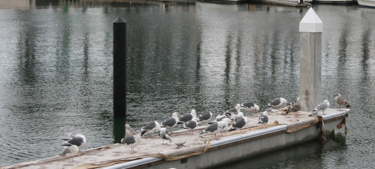

<figure>

<figcaption>Photographer: me</figcaption>
</figure>

grounded, wings tucked, still,
mute gulls outwait the drizzle &mdash;
wet friends on a plank.

I was walking past the marina just north of the <a class="zem_slink" title="Exploratorium" href="https://maps.google.com/maps?ll=37.8027777778,-122.448333333&spn=0.01,0.01&q=37.8027777778,-122.448333333 (Exploratorium)&t=h" target="_blank" rel="geolocation">Exploratorium</a> in San Francisco in late December, 2012. I noticed that one of the docks was dotted with birds trying hard to ignore the drizzle. A bunch of gulls is called a "screech," but this one wasn't screeching much. I thought it made a nice shot with the black and white pillars, the texture on the water, and the boats and trees in the background. The Golden Gate Bridge is hidden by the red-roofed building in the background.