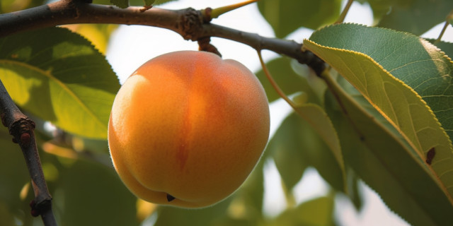

<figure>
</a><figcaption>Image credit: Midjourney</figcaption></figure>

No, artistas de Babilonia,
sus pinturas no me llaman:
por el rojo perfilada,
en la sombra amortajada,
con matiz de azul, velo de púrpura,
su casi-sonrisa casi escondida.

No, no me llaman,
pues yo la he visto.
Y yo la pintaría—

albaricoque

sí—albaricoque y blanca—
luciendo con la timidez
de virgen primavera;
sonrojándose,
riéndose,
abriendo
a la melosidad del verano
y en ternura esperando
con la promesa
de hueso
y de árbol
y de albaricoque venidero.

English translation, by the author:

No, artists of Babylon—
your paintings do not call me:
silhouetted by the red,
shrouded in the shadow,
with shade of blue, veil of purple,
her half-smile halfway hidden.

No, they do not call me,
for I have seen her.
And I would paint her

apricot—

yes—apricot and white—
shining with the shyness
of virgin spring;
blushing,
laughing,
opening
to the mellowness of Summer
and in tenderness waiting
with the promise
of stone
and tree
and apricot to come.
