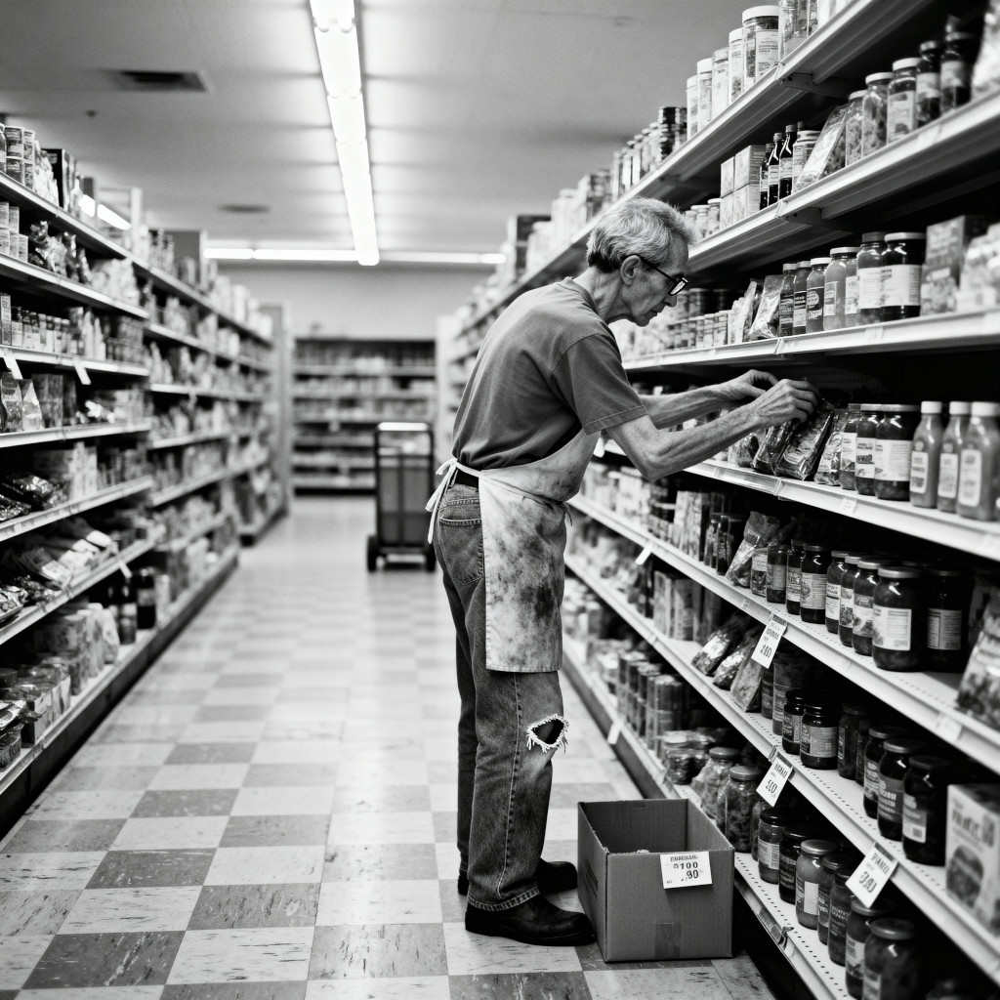

Lyrics are by [me collaborating with AI](ai-collab).

[listen to a performance of the song](https://suno.com/s/IwwPmCqtWlnGaXWq) 

<figure>

<figcaption>Image credit: <a href="ai-art">AI+</a></figcaption>
</figure>

[Verse 1]
There's a man who stocks the shelves at the grocery store downtown
Been there twenty years or more, and never makes a sound
Folks say he's slow, they say he's simple, say he's not too bright
But nobody sees him slip his mama notes each Friday night
'Bout the weather rolling in, 'bout her favorite shows
'Bout the things that make her laugh, all the stuff nobody knows
They see his awkward shuffle, hear him humming out of key
But they don't see the son who calls her faithfully at three

[Chorus]
The facts we think we know
are not the facts that matter most.
The truth upon the surface's
not the one that holds us close.
There's a deeper kind of knowing,
past the labels and the blame --
alternative facts are beating
in the heart beneath the name.

[Verse 2]
I knew a couple, odd as any two you'd ever meet
Her all bones and books and glasses, him too heavy on his feet
Jane and Mister Sprat, we'd joke, behind their backs sometimes
'Til the day he passed away and she spoke words that silenced minds
She said he was her morning light, said he was her north
Said his laughter was the reason she kept traveling back and forth
We'd seen them at the diner, walking hand in hand each day
But we'd never seen the marriage—that runs deeper than we say

[Chorus]
The facts we think we know
are not the facts that matter most.
The truth upon the surface's
not the one that holds us close.
There's a deeper kind of knowing,
past the labels and the blame --
alternative facts are beating
in the heart beneath the name.

[Bridge]
You can't sum up a soul in a word or two
Can't fit a life inside a box labeled me or you
Every sinner's got some grace notes, every saint's got scars
And the most important things we are
Ain't the things that show from far

[Verse 3]
There's a mother at the hospital, her son is wrapped in shame
Car totaled, blood test taken, only got himself to blame
He looks up through his tears and asks her, "You must hate me now"
She just shakes her head and holds him, makes a mother's sacred vow
"I love you" is the only truth that matters in that room
Everything else is footnotes to the fact that filled her womb
The anger and the fear are real, but they're not the deepest well
Sometimes love's the truth that's truer than the facts we try to tell

[Chorus]
The facts we think we know
are not the facts that matter most.
The truth upon the surface's
not the one that holds us close.
There's a deeper kind of knowing,
past the labels and the blame --
alternative facts are beating
in the heart beneath the name.
Yeah, alternative facts are living
In the grace we can't explain.

[Outro]
In the grace we can't explain...

