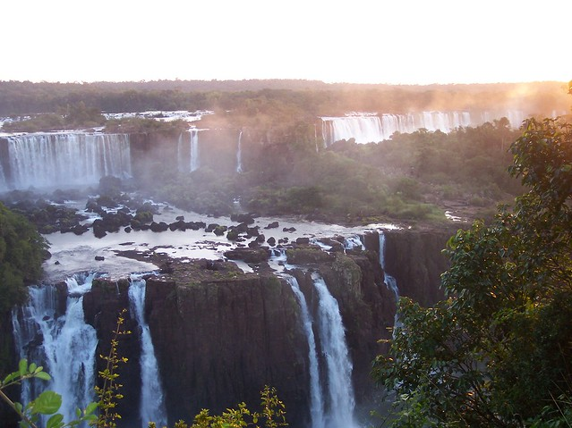

<figure>

<figcaption>photographer: me</figcaption>
</figure>

white thunder sings, sings;
audience of growing green
rustles in applause

I took this shot from the Argentine side of Iguazu Falls in June 2006. I was told that the water flow was unusually low. The sound and mist become overwhelming as you get close. Truly magnificent!
