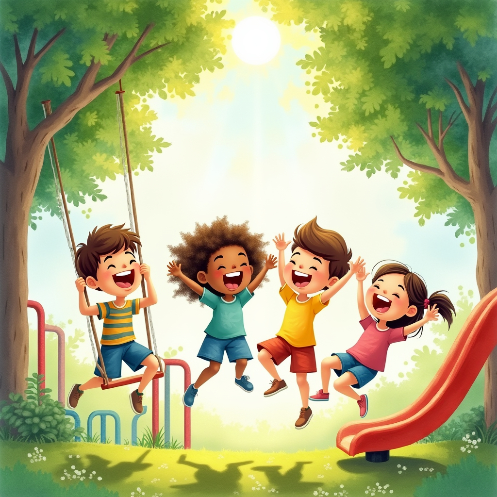

<figure><figcaption>Image credit: <a href="ai-art">AI+</a></figcaption></figure>

I restarted piano lessons after many years, and my teacher asked me to write an original tune and figure out which chords made nice-sounding harmony. This is the result. The bottom hand should be more playful, but I kept it simple because this is as much as I could play at this point in my progression.

[ [piano score](assets/at-the-playground.pdf) ]
