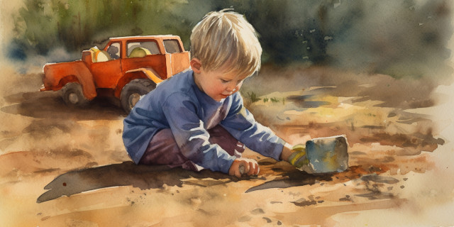
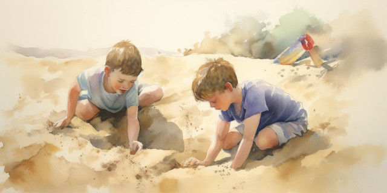
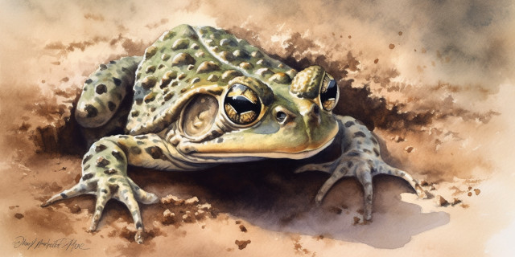

<em>a bedtime story for Caleb...</em>

Once upon a time there was a little boy named Avery. Avery had brown eyes and white teeth. He liked to swim and dig in the sandbox and play with cars and eat popsicles. He was almost five.

<figure><figcaption>Image credit: Midjourney</figcaption></figure>

Avery’s dad liked to call him “Very”. Avery thought that was a funny nickname. “Dad,” he said every day, “Why do you call me ‘Very?’”

“Because I love you very much,” said his dad.

“What else?” asked Avery.

“Because you’re very nice to your mom and your brothers and sisters,” said his dad.

“What else?” asked Avery.

“Because you’re very ticklish,” said his dad.

“I’m not ticklish,” said Avery.

“Oh yes you are!” said his dad. And he tickled Avery.

Avery laughed and laughed. He liked to play with his dad because he knew his dad liked him.

When that was done Avery went outside to dig in the sandbox. He took a big bucket. Tex was already there.

<figure><figcaption>Image credit: Midjourney</figcaption></figure>

Tex and Avery were best friends. Tex was almost five, just like Avery. He liked everything that Avery liked, except root beer.

Tex couldn’t walk very well because his legs weren’t strong enough, so he rode in a wheelchair. Avery thought Tex’s wheelchair was cool because it could go as fast as his bike, and it had a horn and a walkie talkie watch in the pocket. Sometimes Tex would give him rides.

Tex was not in his wheelchair when Avery saw him. He was sitting in the sand, digging with a shovel.

“Hey, Avery, come see,” said Tex. “I’m going to dig a hole as deep as my head.”

Avery liked deep holes. He started helping Tex.

They had been digging for a few minutes, and the hole was getting very deep, when Avery felt something squishy at the bottom. He looked in and saw some rubbery, warty stuff.

“What’s that?” asked Tex?

“I don’t know,” said Avery. He touched it with his toe. It felt like a basketball except that the bumps were bigger.

“Maybe it’s a dinosaur,” said Tex.

Avery liked dinosaurs. He climbed in the hole and bounced up and down on the stuff. Suddenly he felt the sand start to shake. His hole wiggled and shivered, and a giant frog climbed out.

<figure><figcaption>Image credit: Midjourney</figcaption></figure>

The frog was taller than Avery. It looked at him with its big eyes.

“You woke me up!” it said.

“Sorry,” said Avery. Avery didn’t like it very much when his little brothers woke him up from a nap, so he figured the frog didn’t like it either.

“Why were you asleep under the ground?” asked Tex.

“It was the only place I could get some peace and quiet,” said the frog.

“If you want, you can get back in the hole and I’ll cover you up again,” said Avery. He wanted to make the frog feel better.

“That’s very nice of you,” said the frog.

“Or we could find some bugs for you to eat,” added Tex.

<figure><figcaption>photo credit: Ana_Cotta (Flickr)</figcaption></figure>

“Yuck! Who wants to eat bugs? They taste terrible.” said the frog.

Avery thought about what bugs might taste like, and he decided the frog was right. “Do you like popsicles?” he asked.

“Popsicles!” said the frog with delight. “I love popsicles.”

“I’ll get you one,” said Avery. He was a very nice boy, and he liked to do things to make friends with people. He ran inside and found his mom, who was busy reading books with the babies.

“Mom,” said Avery, “there’s a giant frog outside. He wants a popsicle. Can I give him one?”

Avery’s mom looked at him. “Are you sure it’s a giant frog that wants the popsicle, and not a hungry Avery?”

Avery laughed. “C’mon, Mom. I said he could have one.”

“All right,” said Avery’s mom. “Make sure you put the wrapper in the garbage instead of leaving it on the grass.”

<figure><figcaption>photo credit: Thomas Hawk (Flickr)</figcaption></figure>

Avery said thank you (he was a very polite little boy), got a popsicle, threw the wrapper in the garbage (he was also very obedient), and took the popsicle out to the frog. The frog slurped it up with one giant lick of his sticky tongue, then smacked his lips and burped.

“Gross,” said Avery and Tex. They burped sometimes, too, but the frog’s burp was just as giant as he was.

“Well,” said the frog, “thanks for the treat. Before I go back to bed, would you two like a ride on my back?”

“Sure!” shouted Avery.

“You bet!” shouted Tex.

Avery helped lift Tex onto the frog’s back. He knew that Tex would feel sad if he didn’t get a ride. Then Avery climbed up behind him, and the frog made a jump right over the top of Avery’s house. They flew through the air again and again, sometimes passing over trees, bikes, and cars. They even jumped over Avery’s sisters who were playing in the sprinkler in the front yard.

<figure><figcaption>photo credit: SSTUDIO Samuel Bietenholz (Flickr)</figcaption></figure>

When they were done, Avery and Tex dropped in a heap into the sand. They were laughing.

“Did you have a good time?” asked the frog.

“Sure!” shouted Avery.

“You bet!” shouted Tex.

Then they watched as the frog settled down in the sand, and they got their shovels and buried him again so he could go back to sleep.

After he was gone, Avery and Tex listened carefully. When everything was perfectly quiet, they could just hear him snoring.