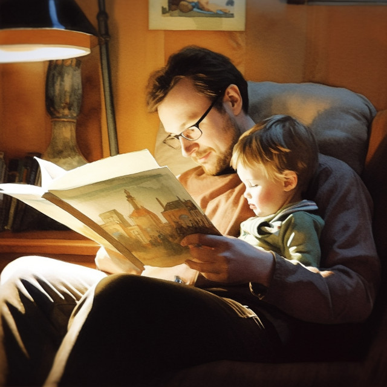

The song of the book lit his eyes as he ran,
and pulled in my arms to encircle his waist.

"Read story!" he shouted, while impatient hands,
pressed open the cover and fumbled in haste.

Soprano pronouncements subsided, fell still;
he snuggled and sighed while I whispered the tale.

Loved ragged, I basked in his artless, pure spell
and squeezed my <em>I love you</em>s no language can tell.

<figure><figcaption>photo credit: liquidnight (Flickr)</figcaption></figure>