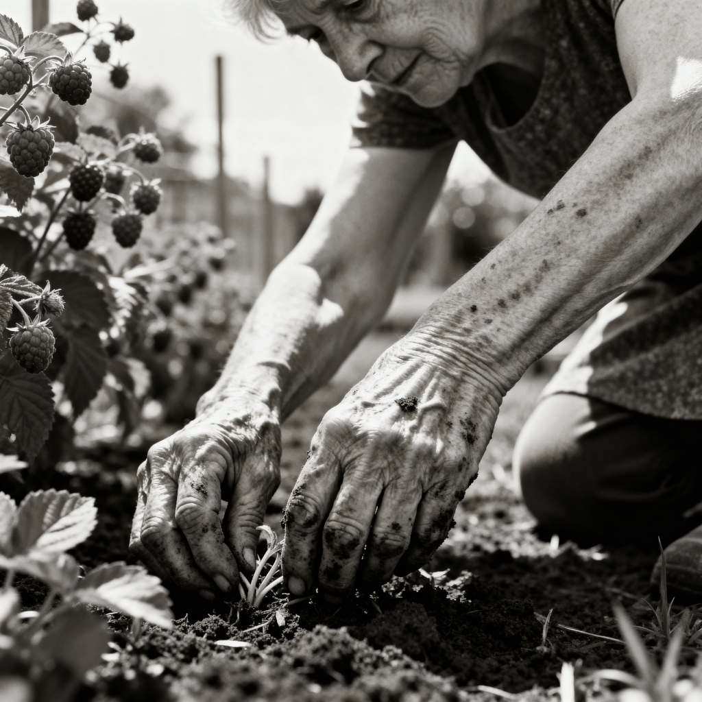

This song is about my grandmother, Margaret Deane Pitts Hardman. Lyrics are by [me collaborating with AI](ai-collab), inspired by a poem of the same name and about the same woman, by Margaret's friend Anne Wesenberg.

[listen to a performance of the song](https://suno.com/s/9RF5cctsh1XWVhpg) 

<figure>

<figcaption>Image credit: <a href="ai-art">AI+</a></figcaption>
</figure>

[Intro]
(whistling)

[Verse 1]
Brown — the color of her hands,
Soil-stained from feeding land.
Brown — her hair, her sun-kissed skin,
The shade where all good things begin.
She’d hum and whistle soft and low,
A kettle’s song, a garden’s glow.

Oh, ohhhhhh
(whistling)

[Chorus]
Brown — like earth that brings life through,
Like bread and bark and honest truth.
Not silk or lace, not diamond-bright,
But warm as dusk and kind as light.
She never tried to shine, but somehow —
The world's light warmed with her sweet brown.

[Interlude]
(whistling)

[Verse 2]
They placed her high with ladies fair,
In lace and pearls and perfumed air.
She wore her brown gown, modest grace,
No ribboned trim, no silver lace.
When tears welled up, she dabbed her eyes
on a paper towel -- plain -- no surprise..

Oh, ohhhhhh

[Chorus]
Brown — like crust on home-baked bread,
Like stew she stirred and prayers she said.
Brown — like fields at harvest time,
Like jars of peaches, pear, and brine.
She never tried to shine, but somehow —
The world’s light warmed with her sweet brown.

[Verse 3]
Rows of berries, rows of beans,
A worn-out hat for the sunshine’s heat.
Kids would come — she’d leave the ground,
Wash her hands and gather ‘round.
Stories, songs, and something sweet,
Mercy made in kitchen light.

Oh, ohhhhhh
(whistling)

[Bridge]
She fed the hungry, soothed the small,
Held broken hearts that couldn’t tell.
With puppets, voices, gentle art,
She stitched the seams of shattered parts.
Imperfect teeth made a perfect smile —
Proof that grace redeems our trials.

Oh, ohhhhh
Oh, ohhhhh
(whistling)

[Chorus]
Brown — like soil when spring comes through,
Like love that stays when days are new.
Not silk or lace, not diamond-bright,
But steady, warm, and just as light.
She taught me what can’t be worn down —
The soul of grace is colored.... brown.

Oh, ohhhhh

[Outro]
Oh, ohhhhh
(whistled embellishments and "Oh, oh" fade gradually)

