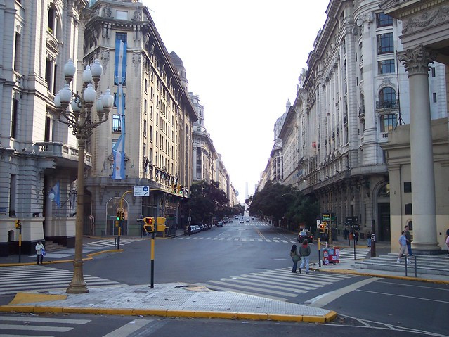

<figure>

<figcaption>Photographer: me</figcaption>
</figure>

buildings, people, cars
painted lines, and sky itself
seek angled union

I took this shot during a visit to Buenos Aires a few years ago. It was June (winter) there; hence the folks in jackets.

I like the interesting shapes in the photo &mdash; the triangle outlined in yellow in the foreground, the funky pentagonal intersection. The V formed by the skyline along the tops of the buildings is perfect for art teachers who want students to notice perspective.

[[other photo sizes](https://www.flickr.com/photos/daniel_hardman/1413111083/sizes/l/)]