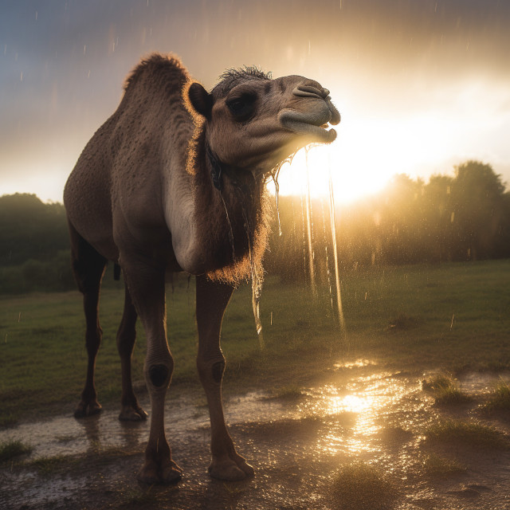

<figure><figcaption>Image credit: <a href="ai-art.md">AI+</a></figcaption></figure>

Be patient with my artless stroke,
and gentle with my timid heart,
and know it's joy, and fear you felt
reflected in the words I spoke.

Oh, it was only yesterday,
I walked the desert heat.
The dry land sent me sand for suck,
and every dreary step
sent curls of lonely dust
in swelling, dizzy spirals
down my swollen throat,
to settle dry and bitter
and heavy on my heart.
Even my tears ran sand,
sharp and hard and empty.
And it was only yesterday
that starved for loving water,
somehow I survived,
and taught myself of solitude.

And now I see I learned too well;
Afraid, I pause and splash,
and shy the sweet, sweet wet,
and drink, and choke, and cry;
for I don't know the water, yet.
