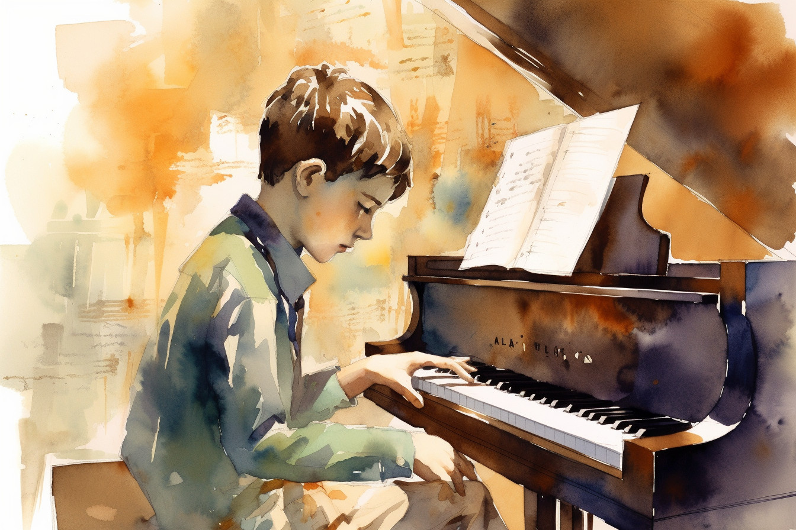

I always knew that he really was not lazy. In spite of the impression that he left at school, Alec was a very hard worker. It was just that he chose to pour his soul into music instead of homework. He didn't fail entirely, but his grades were miserable. Lawrence and I had both been honor students, and it hurt us to find that our child just was not interested in academics.

<figure><figcaption>Image credit: <a href="ai-art">AI+</a></figcaption></figure>

Sometimes when Alec walked in after school with his textbooks buried in reams of music-covered staff paper, I was especially angry at myself for ever starting my son on music. He was gifted, I knew &mdash; perhaps more gifted than anyone had ever been before. Only a month after the lessons began, my little boy had written his first sonata. I didn't have the heart to spoil his confidence in the music by playing it in front of him. After Alec had gone to sleep did I softly play the piece on the old grand piano. To my delight, the piece worked; it was utterly charming. How I wished, though, that I had not encouraged Alec so much after that &mdash; doubling his lessons, furnishing materials, even buying him an advanced synthesizer for his seventh birthday.

But I had not foreseen the hold that Alec's passion for music could exert; everything else was secondary. Alec would come home from school and disappear into his room, emerging only for a hurried meal after much scolding. He spent hours sitting at his desk, pen in hand, writing page after page of flawless, stunningly beautiful music. He wrote everything &mdash; concertos, fugues, etudes, oratorios, even symphonies. And they were all good. Not just pretty or technically correct; Alec's works were masterpieces. Always.

When Alec finished a piece, he'd yawn, stretch, and perhaps play and record it on his synthesizer. If he did play, it was always once through, and it was always perfect. After he finished playing it, he'd take out the tape of his newly recorded music, add it to the stacks that filled several boxes in his closet, and put the written music on the bookshelves that lined an entire wall of his room. By the time Alec was eight, he had filled almost half of them with sheet music.

I dreaded parent-teacher conferences. They were a time when I was humiliated by my son's poor performance. But at first I endured them, thrilled by Alec's phenomenal ability, and confident that as he matured he would turn his attention back to school. After all, how much music could one human being write before he ran out of ideas?

But when Alec brought home his first report card of third grade, my patience ran out. Alec's grades had always been bad, but for the first time they now included an F &mdash; my son had flunked spelling. I wasn't about to let my child be illiterate. And so I spanked him, hard. Alec said nothing; he only walked quietly to his room with tears streaming down his freckled cheeks and a hurt look on his face.

I waited tensely, expecting an outburst as the door closed. I heard nothing. After a minute of suspense, I opened the door. Alec was writing music furiously. As I advanced into the room, he bent intently over his work, covering his paper from my gaze with an arm and his hunched shoulders.

Seeing my son too caught up in his music even to cry touched a raw nerve. I lashed out recklessly.

"Alec, you're going to shape up. Now. If your grades don't improve a full letter grade by next report card, your career in music is finished. And right now, you're grounded from all music indefinitely. I'm sick and tired of having to talk to teachers who tell me how lazy and disinterested you are. I don't know how to respond, since they're absolutely right. You haven't done anything worthwhile since you started composing. You never talk, or say anything to us. All I want is a little bit of consideration for my feelings. Do you think I like being though of as the mother of an eight-year-old idiot who can hardly write? well, I'm sick of you and your music. Things are going to change!"

And change they did. Alec's tapes, synthesizer, and other music paraphernalia were confiscated. Every day when Alec got home from school, I sat him down and supervised him while he did his homework. I drilled him for a full hour a day on spelling. It was slow going. Alec claimed absolutely no capacity to memorize the random, "pointless" arrangements of letters. I don't know why &mdash; he could memorize hours of music effortlessly. When I asked him why spelling was so hard, he would shrug his shoulders and say "Words are all gray and scratchy. There's no harmony." Alec listened to me spell in total apathy.

At last, however, repetition began to take its toll. More by the sequence of syllables than by anything else, Alec began to spell. He still hated it, but at least he could pound out the words. He spelled mechanically, longing always (I could tell) for his forbidden music. One day, Alec was sitting in a chair, pathetically silent under my flow of letters. His eyes were defocused, his thoughts far away. Suddenly he gasped as if in utter amazement. His jaw dropped, his face filled with an ecstatic light. He burst into tears.

Alec was obviously very happy about something. I decided not to reprimand him for his inattention &mdash; besides, I was curious to know what he was so thrilled about.

"Mother," Alec murmured in delight, "Oh, it is so beautiful! I've never heard anything so..." He gave up trying to describe it, but jumped up and hugged me impulsively, tears streaming down his cheeks.

"Mother, you've got to let me write down this music. I promise I will do anything &mdash; for the rest of the school year I won't even touch my music. I'll memorize every spelling word there is &mdash; anything! Just give me a couple days to write down this music. It's a cantata, and it's the gorgeousest music in the world. Please!"

Alec's face was glowing with hope and excitement. It was really difficult to turn him down. But I knew that spelling was more important for a boy his age, so I told him he'd have to wait until the end of the grading period. Then he would be free to do music, provided his grades were high enough. Alec's face fell, and he began to weep wildly. He refused to be consoled. Every day that week Alec pleaded desperately with me to let him write his cantata down. Each time I denied him he became more and more desperate, but I stayed firm. Alec was nearly hysterical; writing the music was so important that once I even caught him in the middle of the night, tears rolling down his cheeks, writing. The look on his face when I took the music away was pure agony, but I knew that it had to be done.

Finally I managed to impress Alec with the fact that school would come first &mdash; he had better buckle down, or music might be permanently denied. Once Alec came to terms with that, I had never seen him work harder. He fairly poured himself into his schoolwork. His teachers reported that Alec was listening and participating in class for the first time, he was doing well on tests. Spelling continued to be a nemesis for him, though. He spent tedious hours copying words hundreds of times, until his head ached and his poor little heart was weary of the effort.

I was nervous on report card day, but not for long. Alec burst in, his face radiating sunshine. "Mom!" was all he could say. He just stood there dumbly, holding out his card in a trembling hand. A's and B's &mdash; and an A in Spelling. I was relieved.

"Now can I get out the music stuff?" He asked so eagerly that I had to laugh.

"Can you promise me that you'll keep up in school now?" Alec nodded hastily. "Then yes," I smiled, "you've certainly earned it." Alec departed in a mad rush, shrieking and trembling with delight. He went straight to my closet, where I had hidden the staff paper. Grabbing a big stack of the sheets, he sat down at the kitchen table with a pen and spread the blank pages before him.

Alec's hand hovered over the paper. His face beamed, and his freckled cheeks were damp with tears. I had never, never seen him so excited about anything before. He paused. I waited expectantly for the confident, unerring scratching that always marked Alec's composing efforts. But it didn't come. Alec's face changed. His eyebrows knit, his smile faded in concentration. Then his eyes widened, he gave a shriek of pure anguish, and began sobbing hysterically. I could get nothing out of him except "gone." After a moment he rushed over to the piano in a frenzied panic, and began to play. But the notes were rushed, fumbled, wrong. Alec collapsed again.

"Alec," I whispered soothingly, "I'm sure it will come back to you. Nothing that important ever leaves permanently."

Alec shook his head in dumb misery.

"You didn't hear me, Mother. It's not the music that's gone, it's me. It can't be the same any more. I'm all words and fractions now." He searched my face for a moment, then ran to his bed and collapsed. I rocked him slowly to sleep.

<i>The applause died down as Alec stepped to the center of the stage. He took a deep breath, remembering how hard he had worked to perform well tonight. He felt himself hot behind the stiff white collar. The audience tensed in expectation. As he stepped up to the microphone, his hands trembled. "Cantata..." he announced. He paused for a long time. A very long time. He smiled at his mother, sitting anxious on the edge of her chair. "Cantata," he said again. "C-A-N-T-A-T-T-A."</i>
