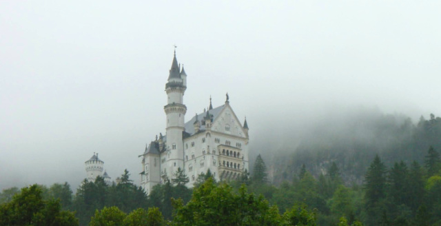

mist maunders over &mdash; 
castle juts, fades in and out &mdash; 
trees, solid, green beneath

I took this from the side of a highway in southern Germany, near the Austria border.

It had been raining all afternoon, and despite the mist, the color of the trees forest just popped, even in the softer light. The castle drifted in and out of the clouds like a ghost.

I later figured out (see comment stream) that I'd snapped a shot of Neuschwanstein. Cool!
