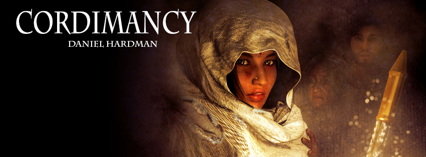

<em>Cordimancy</em> is fiction, intended to be read for enjoyment and pondering. However, it isn't make-believe fantasy where good swaggers off the battlefield with a grin after it vanquishes evil. It has characters, not caricatures, and they encounter real tragedy. This brings harsh themes and flawed resolutions. The darkness on the cover is deliberate.

Lives of people I love and respect (and my own life, too, to some degree) have been touched by some of the traumas that <em>Cordimancy</em> depicts. I know a (mercifully small) bit about how such things can haunt. This makes me alive to the possibility that the book could trigger or hurt a tender heart. I hope not; my aim was to leave you warm and encouraged. I have tried hard to be authentic and respectful without being graphic. Still, we all bring different experiences to a story, and certain combinations might be painful &mdash; so I thought I'd identify content that could challenge the comfort of readers.

<strong>Hard Topics</strong>

All of the following issues show up in the novel, though most are not explored in detail: racial prejudice, loveless marriage, child abuse and neglect, ritualized murder, cancer, patriarchy and women as chattel, political conspiracy, rape and its aftermath, premature death of family members, war, refugees, demonic possession, adjustment to sexuality in marriage, the nature of religious faith and doubt, violence in battle and survival situations, looting, torture, unwanted pregnancy.

The central conflicts in the novel are a quest to rescue kidnapped children, and the emotional challenges of a young couple struggling through PTSD after their village is destroyed and the wife is assaulted. Anyone triggered by those issues might have a hard time, especially.

<strong>Show vs. Tell</strong>

If this book were made into a movie, and it hewed to <em>Cordimancy</em>'s approach, the encouraging parts would be acted out, and the vast majority of the hard topics would manifest in conversation, in internal self-talk of characters, or off screen. There are scenes of battle with humans and monsters, and several depictions of children being treated harshly. But the hardest stuff for me &mdash; the rape and murder &mdash; are discovered rather than witnessed by the reader. Demonic possession is discussed, but shown only very briefly. Sexuality influences the attitudes of married couples, but isn't elaborated.

Shifting stuff off screen doesn't make the material easy, though. A <em>Cordimancy</em> movie would certainly be rated PG-13 for themes alone, and it wouldn't be something I'd take pre-teens to see. A version of the script that opted for more showing and less telling would probably get a more restricted rating. A rough parallel that feels correct to me is the recent big-screen version of <em>Les Miserables</em>.

<strong>Avoiding the Gratuitous</strong>

I feel like it's important to note that all the bleakness serves a purpose. I saw a DVD cover recently where a reviewer touted the non-stop gore and violence, as if wallowing in the ugly should delight audiences. This is not that sort of content. At its heart, <em>Cordimancy</em> is about turning away from darkness, not embracing it.

<strong>More Details</strong>

If you want to read but are worried by my list of hard topics, I've attached some notes that may help you make more fine-grained choices. Beware plot spoilers.

<a title="Notes about Sensitive Content" href="notes-about-sensitive-content.pdf">Notes about Sensitive Content</a>
