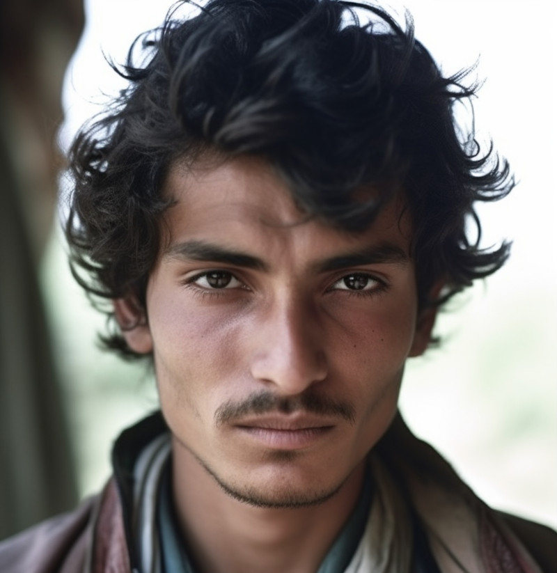
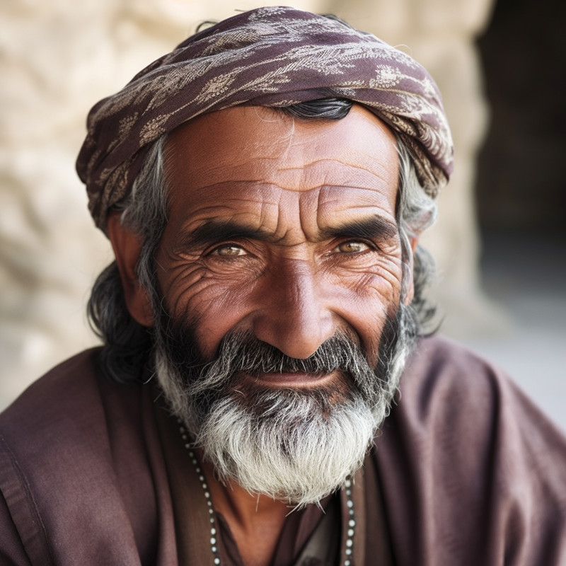
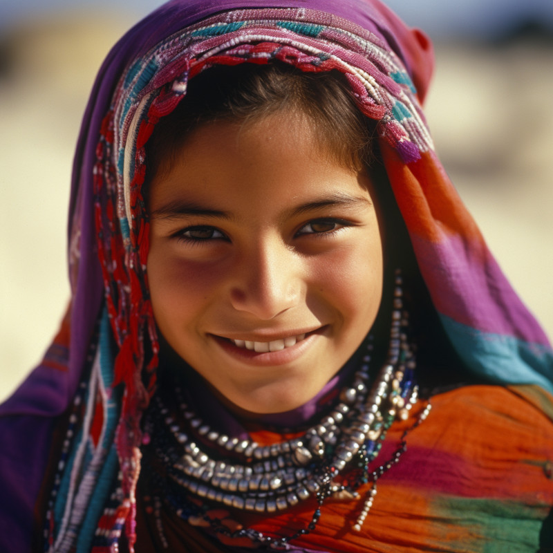
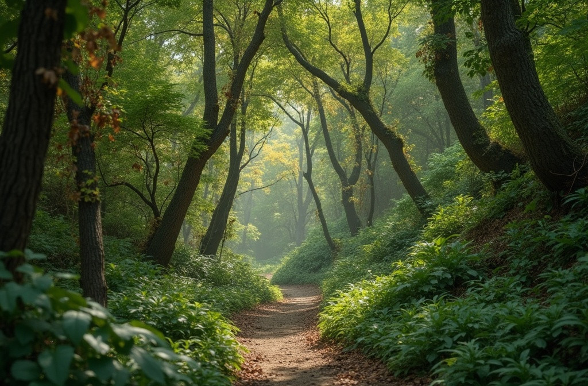

Here are some images that I use to seed my imagination about <em>Cordimancy</em>. Unless otherwise specified, images credit: <a href="../ai-art">AI+</a>.

<figure><figcaption>Malena?</figcassets/</aption></figure>

<figure><figcaption>Toril?</figcaption></figure>

<figure><figcaption>Shivi?</figcaption></figure>

<figure><figcaption>Paka?</figcaption></figure>

<figure><figcaption>Kinora?</figcaption></figure>

<figure>
<figcaption>Oji?</figcaption>
</figure>

<figure><figcaption>Gorumim?</figcaption></figure>

<figure><figcaption>Hika?</figcaption></figure>

<figure><figcaption>Hasha?</figcaption></figure>

<figure><figcaption>Tupa?</figcaption></figure>

<figure>
<figcaption>A forest path similar to the one leading to Two Forks, where Oji, Toril, and Malena confront several Ahu.</figcaption></figure>

<figure><figcaption>The pishacha ride a wild boar like this.</figcaption></figure>
 
<figure><figcaption>The inner building on the palace grounds belonging to the raja in Kikal Pilar.</figcaption></figure>

<figure>
</a>
<figcaption>The inner courtyard of the durga at Noemi might look a bit like this, although I picture it smaller. Image credit: Aleksandr Zykov, Flickr</figcaption></figure>

<figure>

<figcaption>Looking from Kelun holdings down into something a bit lower, like maybe Umara or Bakar.</figcaption></figure>

<figure>

<figcaption>Lands closer to Kikal Pilar, where the river slows and widens</figcaption></figure>
