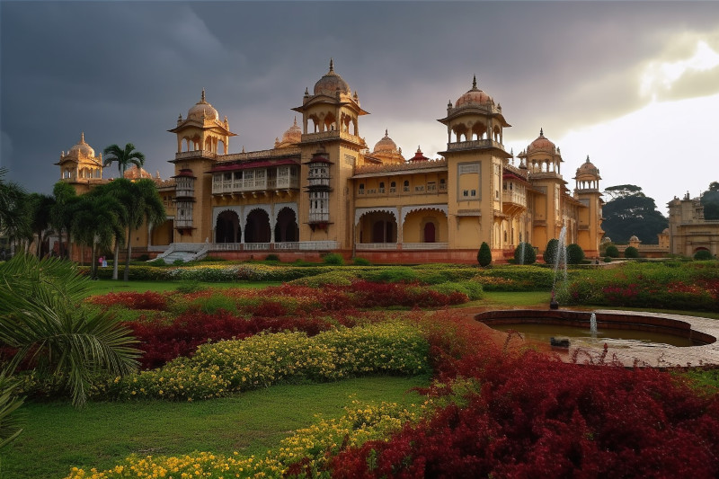

Here are some photos that I use to seed my imagination about <em>Cordimancy</em>.

<figure></a><figcaption>Malena? Image credit: <a href="../ai-art">AI+</a></figcaption></figure>

<figure><figcaption>Toril? Image credit: World Bank Photo Collection (Flickr)</figcaption></figure>

<figure><figcaption>Shivi? Image credit: Anwar.Shamim (Flickr)</figcaption></figure>

<figure><figcaption>Paka? Image credit: fanz (Flickr)</figcaption></figure>

<figure><figcaption>Kinora? Image credit: mctrent (Flickr)</figcaption></figure>

<figure>
<figcaption>Oji? Image credit: World Bank Photo Collection (Flickr)</figcaption>
</figure>

<figure><figcaption>Gorumim? Image credit: Neil. Moralee (Flickr)</figcaption></figure>

<figure></a><figcaption>Hika? Image credit: <a href="../ai-art">AI+</a></figcaption></figure>

<figure><figcaption>Hasha? Image credit: Dey (Flickr)</figcaption></figure>

<figure><figcaption>Tupa? Image credit: World Bank Photo Collection (Flickr)</figcaption></figure>

<figure>
<figcaption>A forest path similar to the one leading to Two Forks. Image credit: Thangaraj Kumaravel, Flickr</figcaption></figure>

<figure><figcaption>The pishacha ride a wild boar like this. Image credit: Mariomassone, Wikimedia Commons</figcaption></figure>
 
<figure><figcaption>A palace like the one belonging to the raja in Kikal Pilar. Image credit: raghavvidya, Flickr</figcaption></figure>

<figure>
</a>
<figcaption>The inner courtyard of the durga at Noemi might look a bit like this, although I picture it smaller. Image credit: Aleksandr Zykov, Flickr</figcaption></figure>

<figure>

<figcaption>Looking from Kelun holdings down into something a bit lower, like maybe Umara or Bakar. Image credit: <a href="https://www.flickr.com/photos/axelrd/9940547854/">-AX-, Flickr</a>.</figcaption></figure>

<figure>

<figcaption>Lands closer to Kikal Pilar, where the river slows and widens (Rikkimaheshwari, Wikimedia Commons)</figcaption></figure>
