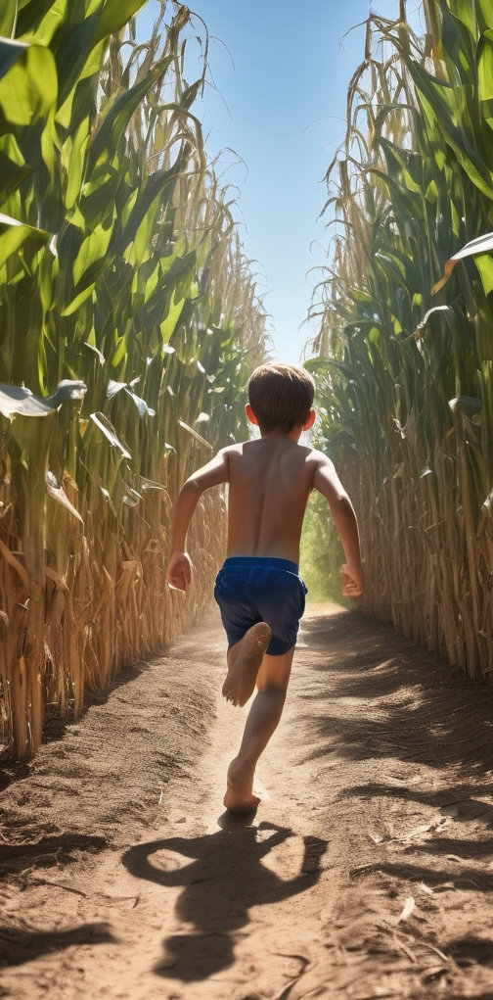

<figure><figcaption>Image credit: <a href="ai-art">AI+</a></figcaption></figure>
<audio controls><source src="assets/cornfield-summers.mp3" type="audio/mpeg"></audio>

Burning yellow days,
racing shaded soil trails
within a stalk-lined maze...

All the late and all the soon
stumbles in the shifting shade...
Through cornfield summers of my youth,
I shoot on barefoot, unafraid.

Smell of dust and leaves,
Tassels whisper, rasp and sway,
bent by vagrant breeze.

All the late and all the soon
stumbles in the shifting shade.... 
Through cornfield summers of my youth,
I romp on barefoot, unafraid.

Toes track dirt, pristine --
arms fend off long lashing leaves,
Eyes squint dappled green.

All the late and all the soon
stumbles in the shifting shade.... 
Through cornfield summers of my youth,
I skip on barefoot, unafraid.

Shoeless,
Shirtless,
Careless,
Timeless...

Drying golden husks,
endless haze of cobalt sky,
Gray stones, roots, sand rust.

All the late and all the soon
falters in the filtered shade --
through cornfield summers of my youth
I press on barefoot, unafraid.

I trot, I gallop, unafraid...

<em>This was originally a poem. I converted it to lyrics and used it to build a [folk song on suno.com](https://suno.com/s/c0YKZ7NmCRelgHCD).</em>
