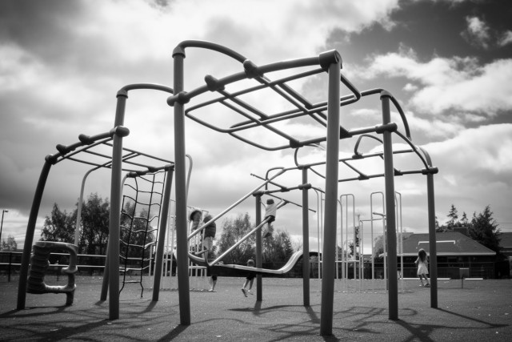

Lunch is over, and I walk out onto the blacktop playground with a growing sense of anticipation. Enough recess time remains for one game of touch nerf football.

Two captains pick teams, and the game begins. I am anxious to play well &mdash; success is a prerequisite for popularity, and like most fifth graders I echo Vince Lombardi's belief that "winning is the only thing." The game progresses, and before long our time is nearly gone. With practiced sophistication our quarterback/captain calls us into a huddle to outline our strategy for the next play. As I jog in, I hope to be favored with a major role so that I can prove my maturity and talent. Nodding at me he says "Hardman, you go long."

"Long!" I think ecstatically. The receiver who catches a bomb is a sort of temporary celebrity. It is my chance to shine, and I am confident that I will.

As the ball is hiked, I dodge through the guarding ranks to the limit of our quarterback's range. Seeing me, he lobs the ball high and hard. Eyes locked, I pump my legs as fast as I can, and snag the ball triumphantly. Without breaking stride I change direction, thinking about the imminent touchdown, and what a great play I am making.

Unexpectedly I feel a terrific shove from the left: an opposing team member has managed to reach me with a wild dive. By pushing me hard he stops his fall, but I careen to the right, still at full speed, and hit a set of monkey bars head first. My skull thuds dully as it strikes metal, and the bars ring faintly. My head feels strange. It vibrates in a dull, aching, but not exactly painful rhythm. I am vaguely aware that I have had a serious accident, that the football game has stopped, that I probably need help, but these thoughts don't register fully in my sluggish, confused thoughts. What I am conscious of is a blind fury at the one who has pushed me. I am disgusted that I have not made The Great Play.

<figure><figcaption>Image credit: <a href="ai-art">AI+</a></figcaption></figure>

Slowly, speechlessly I move away from the cold metal to be surrounded by curious football players. Even though I am not surprised by the chorus of voices asking "Are you all right, Dan," the question bothers me. It strikes me as selfish, as if the questioners want me to say yes to that they can continue the football game. And so I let my anger swell, though deep down a part of me is rather amused at the question. Am I okay? Does a chicken have lips?

Before I can chew out the questioners, another boy answers for me. "Of course not! He's bleeding. Can't you see?" I clap a hand to my head. Sure enough: the steel bars have ripped a long, bone-deep gash in the skin just below my hair line. Blood is welling up rapidly. I turn and trudge dully in the direction of the doors that lead to the nurse's office.

Several kids offer to help me walk, but to accept help is to admit weakness; I tell them in a surly fashion that I am okay, and want to be left alone. Fortunately they ignore my protest, and walk with me en masse to the doors, steadying my rather erratic steps. By the time I reach the building, I am half-blinded by blood, and don't want to remove my hands from my forehead, so I wait impatiently until someone opens the doors for me. I feel hypocritical for refusing help so rudely, and then expecting my friends to open the door without being asked, but I am too proud and angry at the world to apologize, or even murmur a thanks. They ask if I want someone to go with me to the nurse, but I insist that I'll be fine, so they leave me to walk alone down the empty halls.

When I reach the nurse's door I try the knob &mdash; locked. This annoys me. I knock impatiently. The nurse's voice comes back through the wood: "I'm busy with someone right now." I am surprised and a little disgruntled that she dismisses me without even checking my condition, so I hesitantly explain that I am hurt pretty badly. When she tells me (still through the door) to sit on the bench near the door and wait, though, I try to make my voice sound agreeable as I mumble a half-hearted assent.

The bench is soft; it feels good to sit down. The building is very quiet, and I fill the silence with angry thoughts about the player who has injured me, how stupid my friends are, and how wronged I have been. I am either too tired or too weak to catch the blood that runs down between my fingers, and so I watch it splash in bright red spots on the stone floor.

Watching the blood splash has a hypnotic, lulling effect. I am nearly asleep by the time the nurse opens the door and tells me to come in. I watch her expression, hoping to see surprise at my injury; I want her to realize her mistake and apologize for not giving me immediate attention. If she does notice, she gives no indication. Instead she asks me in a mild voice about the accident. She interrupts my monologue to give her standard warning ("this might hurt"), and then cleans the wound thoroughly. Afterwards she says, "Now that wasn't too bad, was it?" I assure her in my most matter-of-fact tone that I have hardly felt it. She nods, gives me an ice pack, and calls home to arrange for stitches.

Soon I slide onto the cracked vinyl seat of our old station wagon beside my mom. "Hi," I say quietly.

"Hello, Daniel," she says. "How are you feeling?"

"Okay," I respond with as much assurance as I can muster. I am probably in shock, and my head throbs, but actually I feel very little pain. I am, however, worried about another matter.

"Mom, how much do stitches cost?"

She thinks for a moment, then gives me a rough estimate.

"Can we afford them?" The question is really unnecessary; I know very well that the answer is no. My mom knows the situation even better than I do. She is quiet for a moment, and then she says, "Daniel, we <em>will</em> afford them, because you are a much higher priority than a car, or a house, or anything we own."

I lay my head on her shoulder. It is warm and reassuring, and I can tell that my mom is offering her silent support and sympathy. Gradually I become aware of a scared, tired, traumatized child within myself, desperately fighting for expression. My first instinct is to be "mature," to keep my emotions in check. But then I realize that my mom doesn't have to be impressed &mdash; she loves me. A few tears trickle down my cheeks, and then an emotional dam gives way, and I begin to cry for all I'm worth. With every tear and sob a little bit of anger, fear, and anxiety drains away, until I feel completely purged. Sometimes it's nice to be a child.