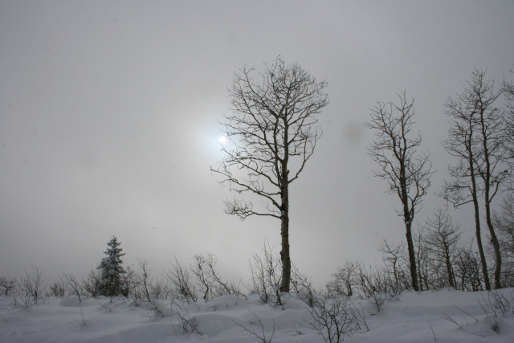

<figure>

<figcaption>Photographer: me</figcaption>
</figure>

hazed by snow, sun slips
t'ward skyline; aspens stand, hail &mdash; 
still, chill sentinels

My wife and I went high into the mountains on a getaway for our anniversary. Above Strawberry Reservoir, on one of the shortest days of the year, the winter light faded early. Even before the sun set, it was diminished by layer upon layer of cloud and ice droplets.

Once we turned off the snowmobile engine and just breathed, the quiet was intoxicating.

