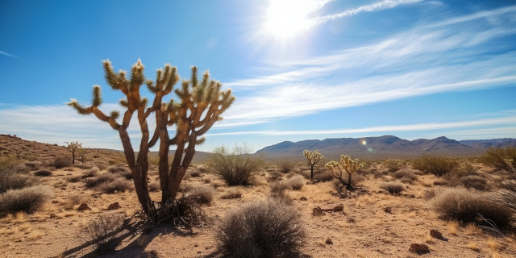
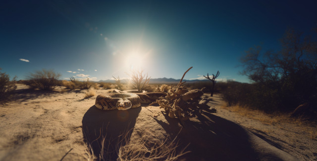
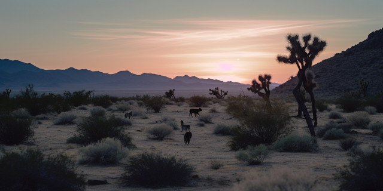

It was painfully sunny, and Rafa tugged on the brim of his broad sombrero. He was parched, but the water had run out on him hours ago. For the tenth time he wondered where Octavio could be. Hadn't he said that they would meet by the hill a couple hours north of the ranch? Hadn't he said at three o'clock? Well, it was six already, and there was no hill. No Octavio.

<figure></figure>

And now Rafa realized that he was hopelessly lost. He had let the horse wander without paying attention to its course. He saw by the position of the sun that they were headed west. Maybe that explained his friend's absence. But he wasn't really content with that explanation &mdash; no &mdash; because surely he had been going north when the ride began, and though he had swerved off course, he should still have seen that hill.

He dropped wearily from the saddle. He couldn't stand another minute on horseback. He had to walk for a minute, rest his sweaty, aching back. He trudged alongside the animal for a few minutes.

Then he saw the snake. It was curled around a rock, sunning itself lazily. Almost without thinking, Rafa picked up a stone and threw it at the reptile. He wanted to hit it in the head, but the stone fell short. The serpent flinched in surprise, and gazed around, seeking to discover its adversary. When it spied Rafa, it began to rattle its tail rapidly.

<figure></figure>

Rafa sat down on a rock and began to speak.

"You and I, we're brothers," he murmured in a rough, throaty voice. The snake just gazed at him, without moving, except for the tail. Rafa took off his sombrero and fanned himself slowly.

"We're brothers, yes. You're here in the desert, without a friend. And me too." There was a long pause, and then: "Snake, you and I are brothers, because I'm all alone. They abandoned me out here, and I'm going to die. Do you hear me, snake? I'm going to die."

He picked up another rock and threw it. This time his luck was better: he didn't strike the snake, but the stone kicked a little puff of parched dust into the animal's unblinking eyes.

Now the snake slid toward Rafa. The horse, which had been standing a few yards away, saw the reptile and skitted away. Rafa tried to call it, but the horse paid no attention. It disappeared over the horizon, leaving a little cloud of dust and an ominous silence.

The snake slipped Rafa's mind. Later, when he had given up on the horse, he collapsed on a large rock, and he remembered. Where could it be? Almost as soon as he thought it, he heard the sinister rattle. It was very near &mdash; yes &mdash; very near. He rotated his head left. It was there, within striking distance of his ankle.

Rafa's thoughts raced. How to distract it, without provoking a strike? Then he remembered the sombrero. Slowly he tilted his head to the side, more and more and more. The sombrero was stuck. He sweat profusely. The sound of the snake was a thunder in his ears now. Every agonizing second it grew louder. He dared not move his legs. Or his arms. With infinite caution he raised his chin, and leaned once again. This time the sombrero was looser from the sweat. The sombrero wobbled, then fell.

It fell where he had hoped. The snake, feeling the hat a threat, struck at it. Rafa scrambled in the other direction. He stood, gasping, as the snake emerged from under the sombrero and stared at him, its tongue flicking in and out. It coiled off behind a cactus.

Rafa cussed, then hobbled in the other direction as quickly as his legs could move. He was bathed in sweat, and wheezing hard, when at last he stumbled to a halt, far to the south.

Now it was getting dark. In the distance he heard the lonely howl of a coyote. From nearby, another answered. And then another. Rafa sweated harder. He hated coyotes worse than anything. His breathing was ragged, but he broke into another run. His boots hammered at the loose stones and sand, his spurs a tinny counterpoint. He lurched faster.

<figure></figure>

Another yip came, much nearer now. Rafa turned right. His legs were weak. He could clearly see where he was going. And then he stepped wrong. He felt his ankle twist weirdly in the boot. He lost his balance, felt himself falling.

His head struck a large stone. Blood oozed from a gash. Rafa listened to the sound of the coyotes, approaching. He wanted to get up, but his arms and legs wouldn't respond. He tried to open his eyes. For a moment he thought he had failed, but then he saw as if through a fog the dim red light of the moon.

And he saw the stars. He saw that there were many stars that night. He thought that probably more than he had ever seen before. He thought that they were beautiful.

He saw the little pebbles on the ground, near his eye. He saw the little pebbles, all ruby red for some strange reason. He thought that he would like to know the reason for it. He would like to know why there were so many little ruby red little pebbles here in the desert. He thought that it would be good to sell them in the plaza on Saturday. He thought that he could make a lot of money, and get very drunk.

He thought that he didn't like to be lonely &mdash; he had never liked to be lonely. He thought that it was very nice, very lucky, that the little doggy had come to keep him company. He thought that he would have liked to say not to stay so far away. He tried to call it closer, but he couldn't speak.

The little doggy seemed to understand anyway, and it came slowly forward. Rafa thought that it was a very nice little doggy. Yes, it was a very nice little doggy.

Images credit: [AI+](ai-art)
