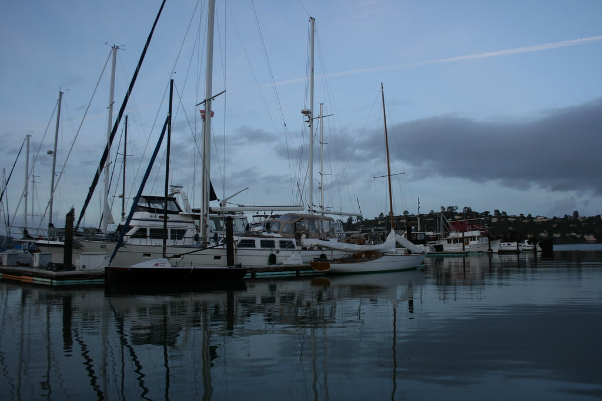

<figure>

<figcaption>Photographer: me</figcaption>
</figure>
 

Under, lapis peace;
over, celeste. Drift to dark's
waiting arms, and rest...

There's something about still water at twilight that leaves me feeling quiet inside. I love the gloss on the surface of the bay.

[[other photo sizes](http://www.flickr.com/photos/daniel_hardman/8331434375/sizes/l/")]