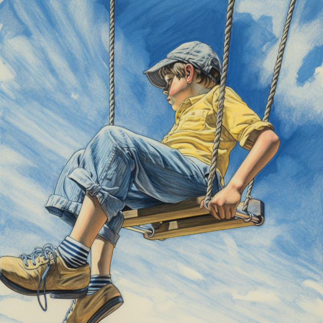
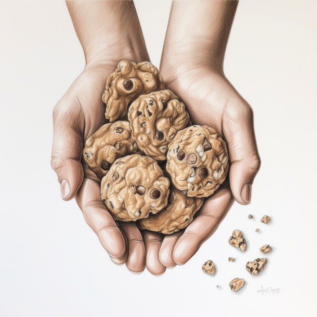
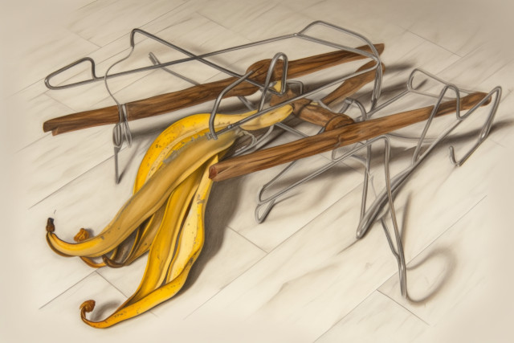
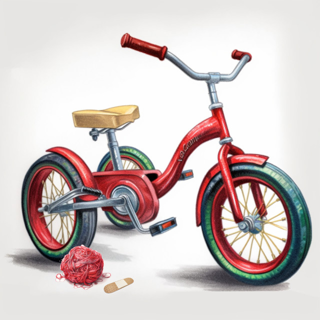
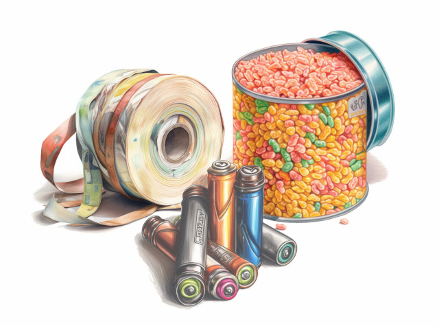
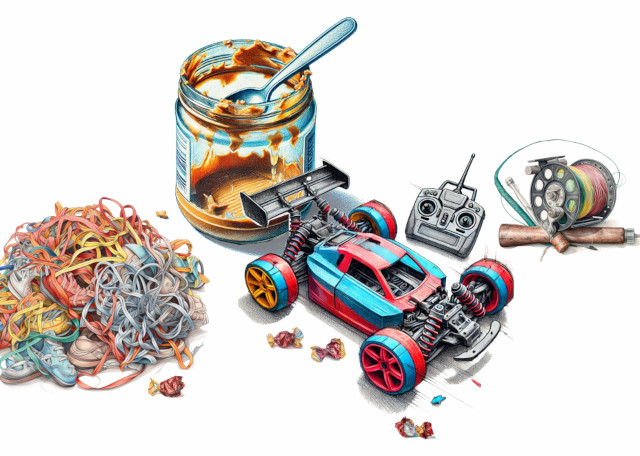
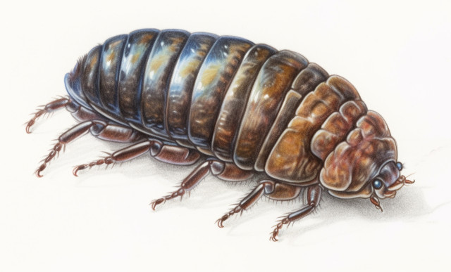
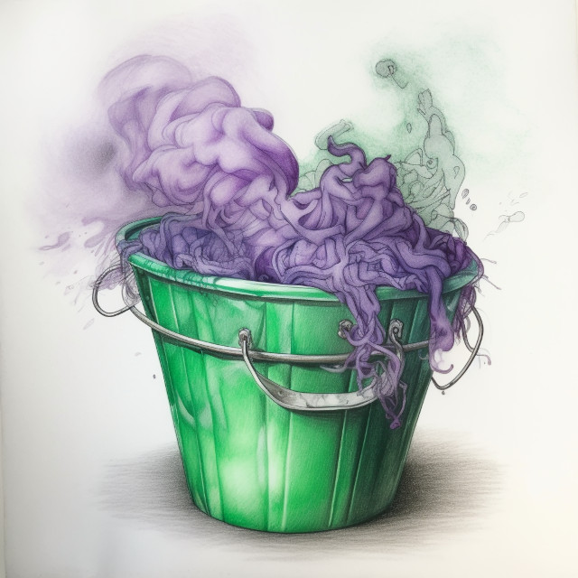
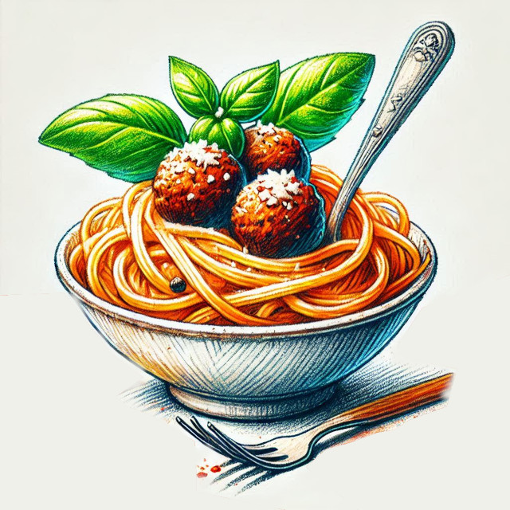

One day when Ethan came home from school, he was bored.

“Try playing on the swings,” said Mom.

“Dance with me,” said his sister, Maia.

“Trucks! Dey dwive fast!” said his brother, Caleb.

Ethan played on the swings. He danced with Maia. He drove trucks.

<figure>

</figure>

He was bored.

“Help me bake cookies,” said Mom.

“Do gymnastics,” said his sister, Maia.

“Doodle bug! It tickles!” said his brother, Caleb.

Ethan ate lots of dough and chocolate chips. He did somersaults. He rolled doodle bugs.

<figure>
</figure>

He was bored.

Then he got an idea.

He would make a spider web machine.

He got some hangers out of the closet in his bedroom. Maia got cotton balls from the bathroom. Caleb got an old banana peel out of the garbage in the kitchen.

<figure>
</figure>

Ethan scratched his head. It was not enough stuff.

He got the tricycle in the garage. Maia got a roll of red yarn from the basket by Mom’s bed. Caleb got a band-aid off his knee.

<figure></figure>

Ethan scratched his head. It was not enough stuff.

He got a roll of tape from the cupboard by the fridge. Maia got batteries out of her flashlight. Caleb got a can of fish flakes.

<figure></figure>

No, it was still not enough. Ethan needed help.

He went over and asked his friend Daniel for help.

Maia went over and asked her friend Meg for help.

Caleb went over and asked Mom to change his diaper. It was very stinky.

Daniel brought an old fishing rod, some shoelaces, and a remote-control car. Meg brought an empty peanut butter jar, a plastic spoon, and some bubble gum wrappers.

<figure><figcaption>Image credit: Copilot, Midjourney</figcaption></figure>

Ethan and Maia and Meg and Daniel spread everything out in the driveway and looked at it. Caleb sat on the peanut butter jar and looked at his doodle bug.

“What we need now,” said Ethan, “is a magic potion.”

“A magic potion!” said Meg.

“A magic potion!” said Daniel.

“A magic potion!” said Maia.

“A doodle bug!” said Caleb.

<figure></figure>

Ethan got an old bucket. It had lots of dirt and a couple dead ants, and even a dusty cobweb at the bottom, so that was a good start. He turned on the hose and added water. Daniel used Meg’s plastic spoon to scrape the last little bits of peanut butter into the bucket. Caleb added his banana peel.

“Ala-kazaam!” said Ethan.

“Hocus pocus!” said Maia.

“Jeepers creepers!” said Daniel.

“Holy smokes!” said Meg.

“Abwacadabwa!” said Caleb.

The bucket sputtered. Purple smoke curled out the top, made a slow circle in the air over their heads, turned green, and then vanished with a sparkle of firecracker sounds.

<figure></figure>

Ethan grabbed the potion bucket and began to dance around, sprinkling droplets of foaming pink stuff all over the fishing rod, the tricycle, the yarn, the band aid, and the plastic spoon. And as he danced, he chanted:

>Spiderweb, spiderweb in a dish.
How many pieces do you wish?

Pretty soon the other kids had joined in, and Meg was tossing bubblegum wrappers like flower petals at a wedding.

They chanted till they were hoarse. But the pile of junk did not turn into a spiderweb machine. And the magic potion was losing its fizz.

“It’s not working,” said Ethan. “We’re missing the magic ingredient.”

“What’s that?” asked Maia.

“Frog legs!” said Daniel.

“Ew, gross!” said Meg.

“Spit!” said Caleb. And he harunged and gakoxed and p-tooied right on top of the whole heap.

<figure></figure>

There was a clap of thunder, and a bright flash of light made them all close their eyes. When they opened them again, there it stood: a shiny new spiderweb machine, complete with windshield wipers and shiny chrome fenders.

“Awesome!” said Ethan.

“Hooray!” said Maia.

“Deadly!” said Daniel.

“Fungacoid!” said Meg.

“All aboawd!” said Caleb.

They drove around the neighborhood, spewing cobwebs all over the trees and Meg’s dog and the mail man and generally having a glorious time until Mom called Ethan in for supper.

“Aw, Mom. Do we have to?” said Ethan.

“What are we having?” asked Maia. “Can we have dessert first?”

“Spaghetti,” said Mom.

“You mean spidew web suwprise!” said Caleb. “Wight, Mom?”

“Wight!” she said. “But no doodle bugs on top.”

<figure>

</figure>

Images credit: [AI+](ai-art.md)