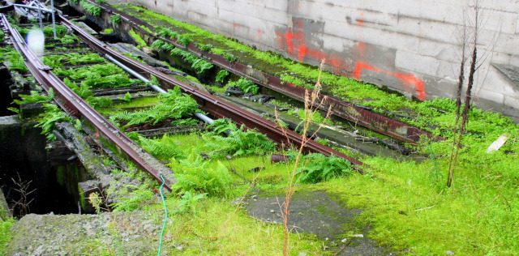

</a>Steel ruled hard here, once,
till a soft, living carpet
ate the Fern Express.

I was waiting to board a ferry to Alcatraz, at Pier 33 in San Francisco, when I noticed this overgrown track alongside one of the buildings. The dereliction and the enthusiastic plant growth made it hard to imagine, but once upon a time I suppose that this was newly constructed evidence of progress. Kind of reminds me of Shelley's "Ozymandias."
