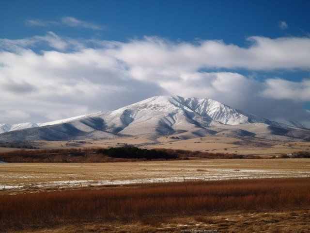

<figure>

</figure>

not yet green, spring lifts
white to sky, paints naked taupe,
terra cotta, rust

The photo that inspired this haiku was taken on the side of I-15, south of Nephi, Utah, in March 2013. Unfortunately, I have since lost it. The image above is a rough recreation by [AI+](ai-art).