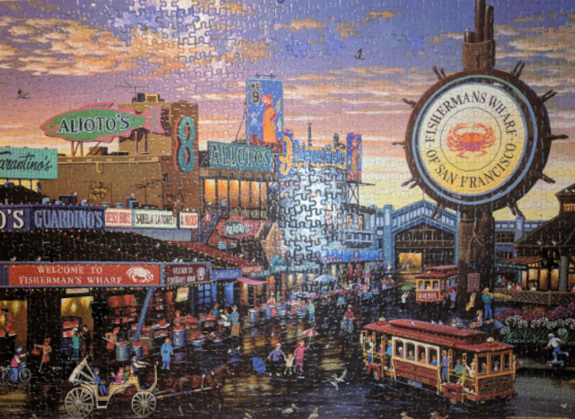

<figure>

<figcaption>The actual puzzle that inspired this poem, pieced together by Steve Felt. Notice a handful of cases where almost-fitting pieces have been repurposed to plug gaps. Photographer: me</figcaption>
</figure>

*for Steve*

It's part the patient piecing. Yes...
And too, the wharf he loved so well,
and frame, and glaze, and sunset sky--
I see his stamp upon it all.

But most, what sings to me of Steve
is what he puzzled out and carved
against the dozen stubborn gaps that
flawed the fit the day he stopped.

Perhaps he knew before he spread
the picture out. Perhaps the lacks emerged.
Either way, it was his wont
to fill life's voids as best he could.

He'd done it with a valve that choked,
a singer's moods, a dentist's dreams,
a sister's babe who needed fathering,
folk who languished, cars that broke.

So Steve graced gaps as grace he must,
scrounging from some lesser box
pieces that fit, or almost did,
and plied his paint to hide his mark.

I wonder if some hand divine
removed those pieces so we'd sense,
the beauty in that fitting echo
from our favorite fix-it man.

