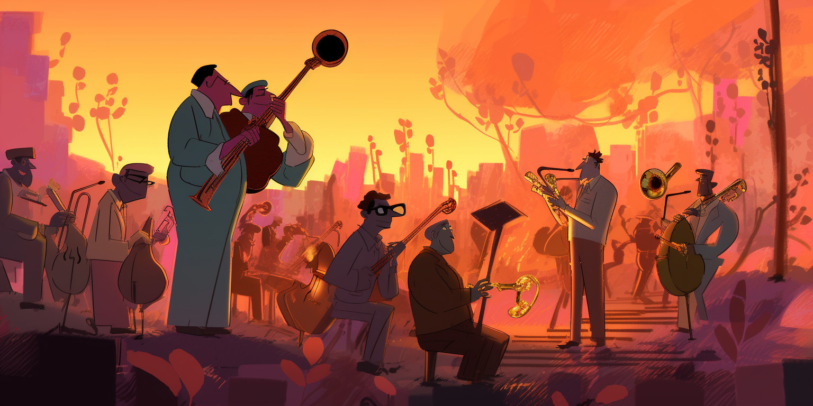
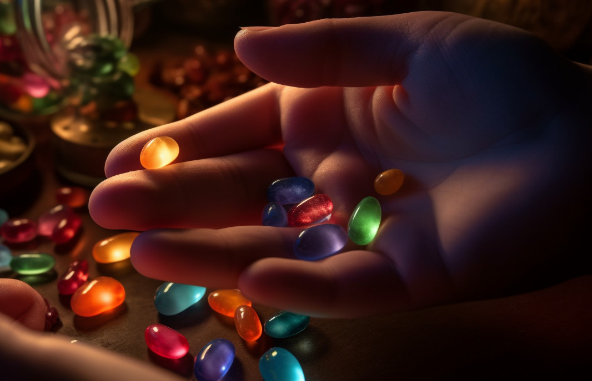
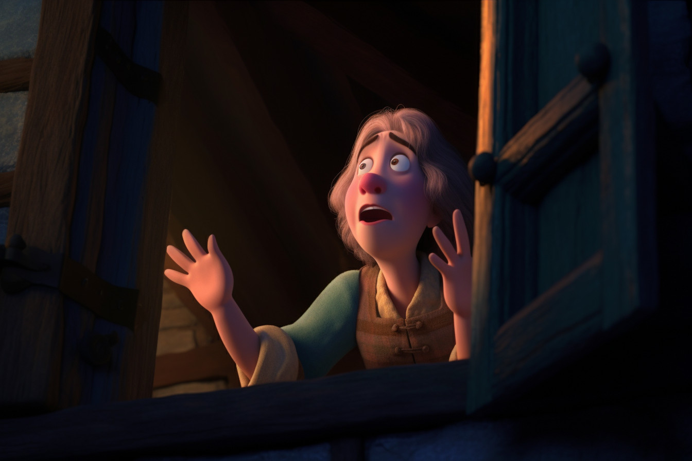
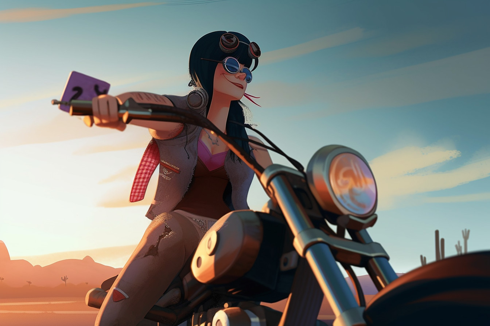
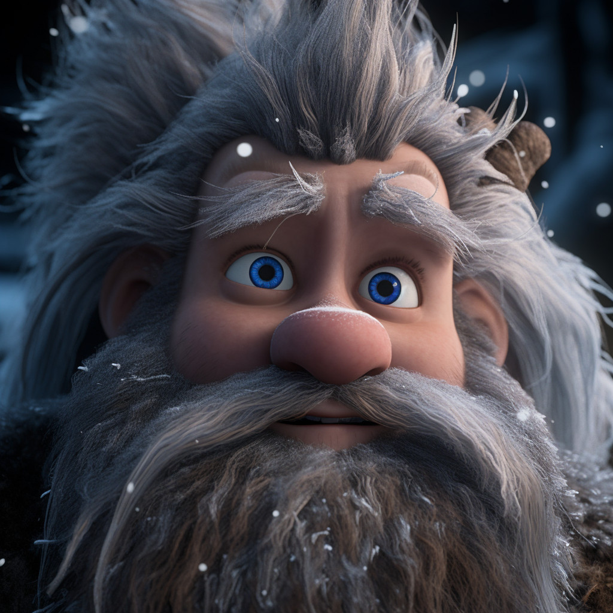
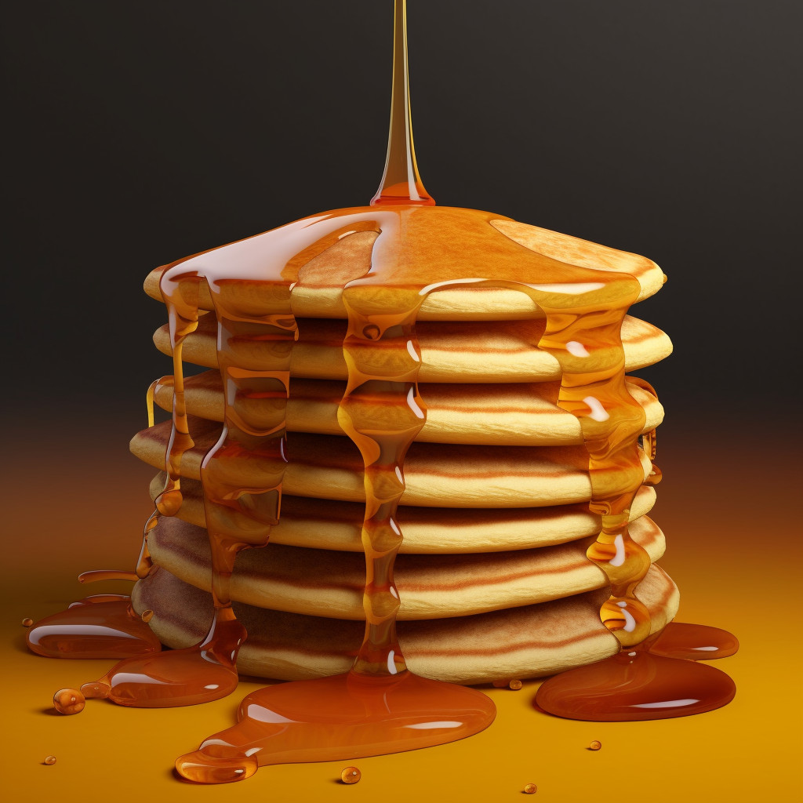

Once upon a time there were three little pigs. They each built a house. One built a house made out of straw, one built a house made out of sticks, and one built a house made out of bubblegum.

After all the houses were built, they decided to have a housewarming party, so they invited all their friends, and they hired a special jazz band named "Big Bad Wolf" to come play in the yard.

<figure></figure>

One of the guests at the party was a little girl with a red riding hood on her head. Her name was Isabel. Isabel hated music, and she loved to make fun of jazz bands especially. So as soon as Big Bad Wolf started to play, she began shouting insults at them.

"My, what a big noise you make!" she shouted.

The leader of the band, whose name was Jack, shouted back at her. "All the better to deafen you with."

"My, what a big bass you have!"

"All the better to rattle you with!"

"My, what a big tuba you have!"

"Then I’ll huff, and I’ll puff, and I’ll blow some bubbles from the bubblegum house."

Isabel thought that sounded pretty drastic, so she changed her tactics. "I’ll tell you what. If you promise to be quiet, I’ll give you some magic beans."

"It’s a deal," said Jack. And he took the beans home to his mother.

<figure>

</figure>

When he got home, his mother was brushing her hair and gazing into the mirror. "Mirror, mirror on the wall, who’s the fairest one of all?" she said in a dreamy sort of voice. Then she saw her son.

"What have you brought for dinner, Jack?"

"I got some magic beans," said Jack.

"What sort of a paycheck is that for all your hard work as a tuba player?" she said. And she grabbed the beans and threw them out the window in anger.

<figure>

</figure>

Jack felt bad, so that night after his mother was asleep he got a handful of breadcrumbs and went out in the back yard to find the beans. He dribbled the breadcrumbs behind him on the ground so that if he got lost, he could follow the breadcrumbs home again.

But while he was out looking for beans, he was kidnapped by seven little men named Snap, Crackle, Pop, Larry, Curly, Moe, and Dopey. They carried him up a hill and over a bridge.

Under the bridge lived an old lady troll. When she heard the first little man, Snap, tiptoe across, she said, "Fee, fie, fo, fum, I am hungry in my tum!" And she grabbed Snap and stuck him in the refrigerator. Crackle, Pop, Larry, Curly, and Moe all had similar misfortune. But when Dopey, who was carrying Jack over his shoulder, got on the bridge, the troll had run out of room in the refrigerator, so she let Dopey across.

<figure>

</figure>

Dopey carried Jack home to their little cottage in the woods, singing "Heigh ho, heigh ho, it’s cucumbers I grow!" in a merry little voice. He didn’t like the way Snap, Crackle, and Pop swiped his Rice Crispies in the morning, so he didn’t mind if the troll froze some sense into them for a while. And he’d always thought Larry, Curly, and Moe were a bit obnoxious in a sort of desperate, yawn-inducing way.

Unfortunately, just as Dopey got to the top of the hill above their cottage, he tripped over a stone. Jack fell down, head over heels. He broke the new crown the dentist had given one of his sore teeth the week before, and Dopey, who came tumbling after, landed right on top of him with a thud.

As they lay there, feeling bruised and dazed, Isabel rode up on her classic Harley Davidson motorcycle. She was wearing chaps and a black leather jacket, and she looked mean enough to skin a tomato.

<figure></figure>

"Glurp," said Jack, who was too dizzy to talk right. "Uh, I mean, where are you headed?"

"To grandmother’s house, silly," said Isabel.

"Where’s that?"

"Over the river and through the woods. Want a lift?"

"Yes, thank you," said Jack. And he climbed aboard before Dopey could grab him again.

The two roared off into the sunrise.

Now it turns out that Isabel’s grandmother was none other than the old troll that had grabbed six of Jack’s kidnappers and chucked them in the refrigerator. By the time Isabel and Jack arrived the little men were all very cold, and their teeth rattled as they shivered. Jack and Isabel heard the noise and looked at each other. Should they get the dwarves out or wait until they were complete popsicles?

The grandmother cackled in her old, troll-like voice and invited them into the back yard to see her beanstalks.

<figure>

</figure>

Jack and Isabel made polite conversation as they walked, but they kept looking back over their shoulders at the refrigerator. They needed a plan.

Suddenly Isabel had a brilliant idea.

"Grandma," she said, "Do you like music?"

"Of course, dear," said the old troll.

"Have you ever listened to a group called ‘Big Bad Wolf’?"

Grandma’s eyes lit up. "I love them. I have every album they ever made."

"Then why did you put their lead singer in your refrigerator?" said Isabel. "He can’t make any music in there."

Grandma looked stricken. "You mean…"

"Yep," said Isabel. "The first three guys you caught on the bridge last night were Big, Bad, and Wolf."

"Oh my stars," said Grandma. And she hurried over to the porch and threw open the door of the refrigerator.

<figure></figure>

"Can you ever forgive me, you marvelous musicians?" she said in a panic.

The dwarves had heard the whole conversation and wasted no time. They scattered in every direction, shouting "Run, run, as fast as you can &mdash; you can can’t me; I’m a tiny little man!"

Grandma was furious when she realized that the little men had run away and none of them were members of her favorite band. She threatened to spank Isabel, but Isabel and Jack just jumped on the motorcycle and headed to McDonalds. If they couldn’t have Snap, Crackle, and Pop, at least they could have some pancakes.

<figure></figure>

Images credit: [AI+](ai-art)