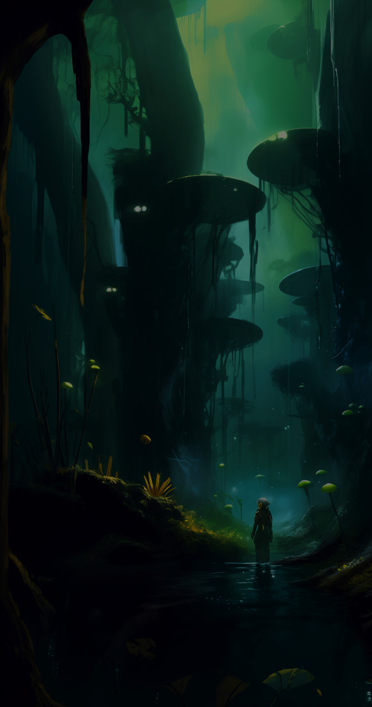

Ponderous clouds broke suddenly, lashing the canopy of tago trees that arched into stygian gloom eighty meters above. Exotic hoots and throaty grunting from beyond the blackness floated down, mixing with a soft lap-lap of marshwater at his waist. Avis fingered the trigger of his blaster and wiped sweat from his eyebrows with a grimy hand. His comlink crackled.

"Red One, this is Red Three. We're sweeping north. Water's extra murky. Musta have been disturbed recently."

The fear in the other man's voice carried clearly through the wet.

"Roger, Red Three. Close in another fifty meters."

The other man acknowledged in clipped tones, and Avis began his own scramble through the muck. He pulled himself onto a mass of roots, slick with slime, and half-slid, half-crawled around the massive bole of a tree, the odor of moldy vegetation strong in his nostrils. They'd been hunting the froggies for nearly twelve hours now, patiently tightening their noose of riflemen to force the bloated monsters inward. When he and his buddy were in place, the circle would be a mere hundred meters across, and they'd burn the diabolical brutes out of existence.

He shivered, thinking of their impossibly massive jaws and bulging eyes. They'd fought the humans to a standstill on this world—but for the last time. Next week human reinforcements would arrive...

Now he was in position, his back against a pebbly boulder, his blaster sweeping the focus point where the froggies would soon sizzle and wisp away as greasy, foul clouds of smoke.

Minutes dragged by.

Where was Clove? He should have reported in by now. Avis was growing increasingly unsettled. He peeled leeches off his neck and winced as blood trickled between his shoulder blades. What was taking them so long? The sounds of the night had faded, and now he could hear his ragged breathing like thunder in the darkness.

"Red Three, this is Red One. Do you copy?" His voice caught as he whispered hoarsely. Nothing. Static. He switched channels. "Red Leader, Red One." Another switch, his hands fumbling with the buttons. "Blue Leader? Green Leader?"

No sound at all except the faint hiss.

He stumbled back into the protective shadow of the rock, nauseated with terror. A current of hot, moist air swelled around his shoulders, reeking of decaying flesh. He lurched, gagging.

And then the rock moved...
