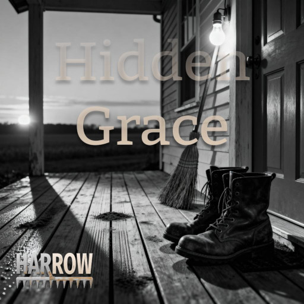

Harrow is a persona I (Daniel Hardman, daniel.hardman+spotify@gmail.com) created to capture my [AI collaborations](ai-collab) that have a country/folk vibe. Harrow is a gravelly baritone who sings with acoustic guitar and not much else. The vibe I'm going for is honest songs about heartache, hope, and being human — for people who know tears can be sacred.

## Albums

[Hidden Grace (2025)](https://distrokid.com/hyperfollow/harrow5/hidden-grace)