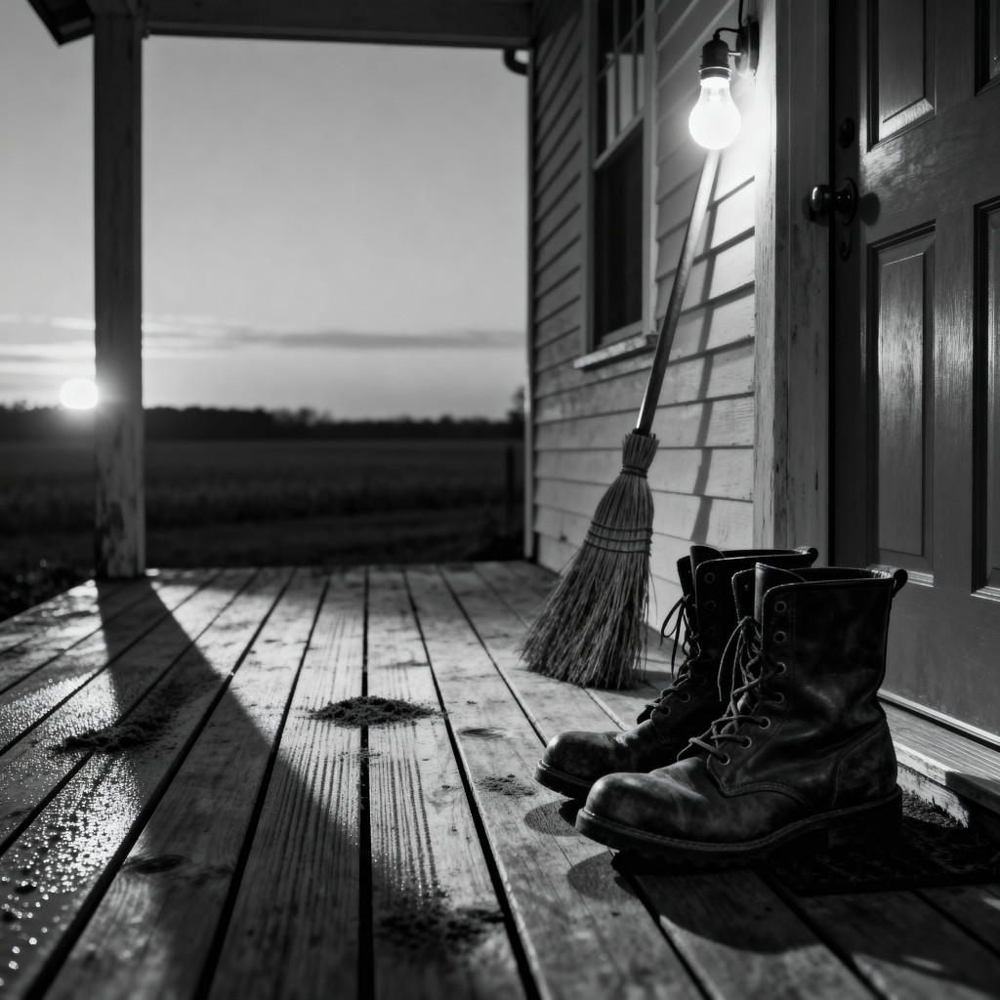

by: [me collaborating with AI](ai-collab)

[listen to a performance of the song](https://suno.com/s/EiovWtMXqqLbRbom) 

<figure>

<figcaption>Image credit: <a href="ai-art">AI+</a></figcaption>
</figure>

[verse 1]
A porch light glows before the day,
Still burnin' after dark gave way.
Swept boards and boots beside the door —
The kind of work that needs no roar.
There's grace in what begins unseen,
In hands that labor in between.

[chorus]
Hidden grace in soil and rain
Changing mud to leaf and grain
Soft as breath between heartbeats
Deep as roots where no one sees.
Look close — it's in the simple things —
Uncommon beauty humbly sings.

[verse 2]
We pass by fields we think are bare,
But seeds are wakin’ under there.
Love don’t shout or strain to show,
It’s steady hands that help things grow.
The roots do their work where no one knows,
Faith is the farmer — grace, what grows.

[chorus]
Hidden grace in soil and rain
Changing mud to leaf and grain
Soft as breath between heartbeats
Deep as roots where no one sees.
Look close — it's in the simple things —
Uncommon beauty humbly sings.

[bridge]
Maybe you have carried it too,
Been someone else's tender truth.
And maybe grace is carrying you
Through tears and dirt, nearer than you knew. 

[chorus]
Yeah, hidden grace is all around,
In every face — even in the frowns.
It’s in the ache that longs for peace,
And in the hands that never leave.
Hidden grace moves through us all,
So smile, and hope, and sing its song.

[outro]
That porch light still burns into day —
Some grace just works that hidden way...

