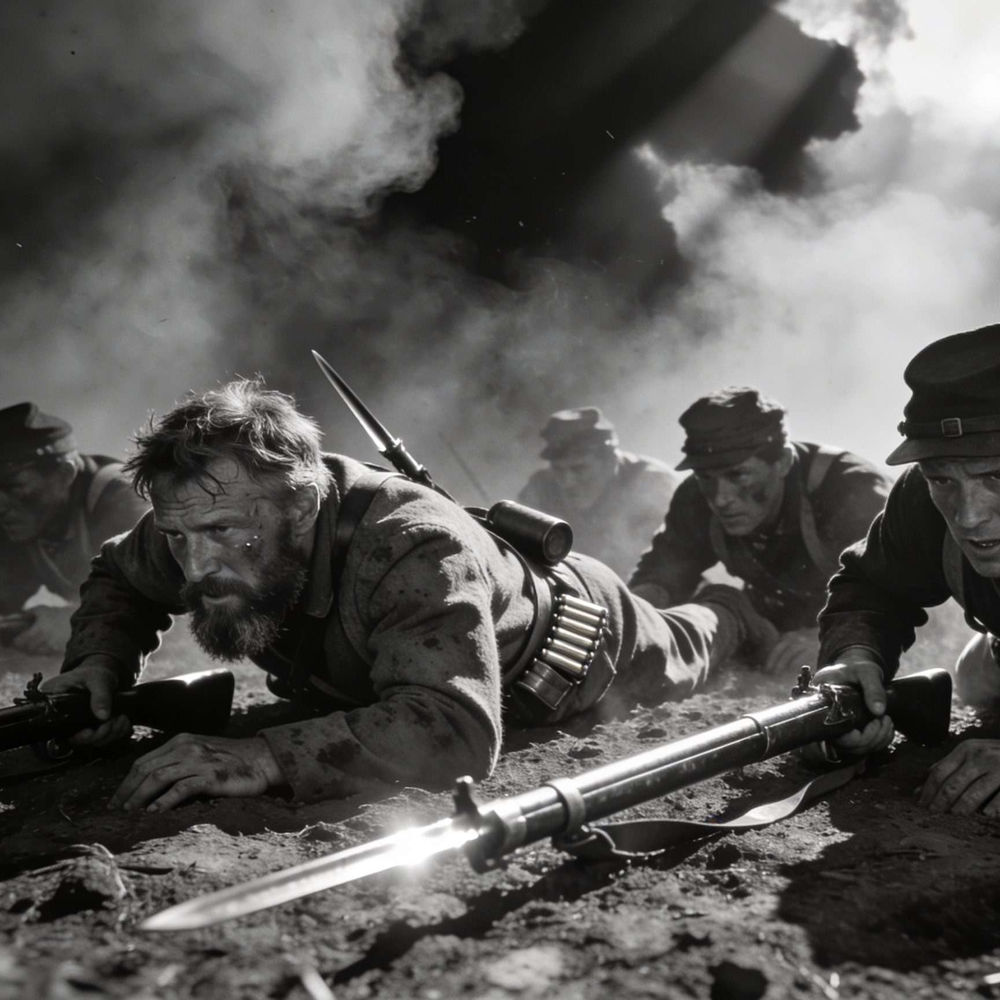

George Theodore Hyatt ("Theodore") won the Congressional Medal of Honor for uncommon and unselfish valor at Vicksburg during the Civil War. He was a sergeant at that battle, and was asked to assign men to a suicide mission; he said he'd gather volunteers instead, and became the first volunteer to step forward. His brother Charlie died in a tragic accident during the war; Theodore himself survived Vicksburg but was later shot through the heel and suffered a debilitating limp plus haunting memories for the rest of his life. He struggled to get the military to pay his pension. He moved to Oklahoma and became a missionary, working among Native American tribes there. Lyrics are by [me collaborating with AI](ai-collab).

[listen to a performance of the song](https://suno.com/song/cc371b7c-ea68-4d59-8f50-816812fe133e) 

<figure>

<figcaption>Image credit: <a href="ai-art">AI+</a></figcaption>
</figure>

[verse 1]
"Sir" ordered bodies for the charge ahead.
The sergeant pondered with a sense of dread,
then stood there still, the flash and smoke in view,
And said he wouldn't force another through  

[chorus]
I’ll go myself, won’t put it all on them.
I’ll take the dirt no ordered man would claim.
No promised glory, no choice to defend  
I’ll go myself, and bear it to the end  

[verse 2]
He gripped the board and ran the open ground  
As shots flew fast, men stumbled, sagging down 
He set it firm and lifted others up  
And felt wood thud as lead screamed all around

[chorus]
I’ll go myself, won’t put it all on them.
I’ll take the dirt no ordered man would claim.
No promised glory, no choice to defend  
I’ll go myself, and bear it to the end  

[verse 3]
Pinned flat, he clung, with fire just overhead  
The earth stretched cold as ears grew numb and deaf
The daylight burned, eyes clenched with grit and tears
He fought fatigue, though any sleep was dead  

[interlude]
(intricate fingerpicked banjo)

[verse 4]
Night came at last. He pulled a soldier free
And dragged him back, since dark would let them see
Another day of fight. Another day.
Until a random ball destroyed his heel. 

[chorus]
I’ll go myself, won’t put it all on them.
I’ll take the dirt no ordered man would claim.
No promised glory, no choice to defend  
I’ll go myself, and bear it to the end  

[verse 5]
He hobbled home and signed his name again  
The years went on, the ache stayed in his frame  
He taught and served, with memory haunting near  
And bore it all with courage under strain

[outro]
I’ll go myself, won’t put it all on them.
No promised glory, no choice to defend  
I’ll take the dirt no ordered man would claim.
I’ll go myself, and bear it to the end
I’ll go myself, and bear it to the end

