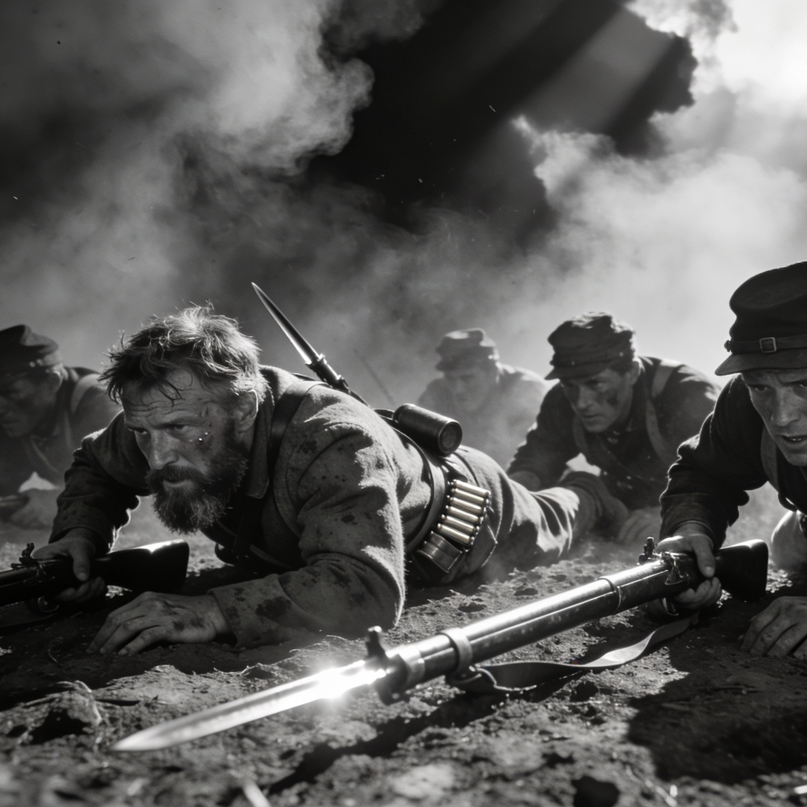

Lyrics are by [me collaborating with AI](ai-collab). Performance by [Harrow](harrow) on [suno](https://suno.com/song/cc371b7c-ea68-4d59-8f50-816812fe133e).

<figure>

<figcaption>Image credit: <a href="ai-art">AI+</a></figcaption>
</figure>

[verse 1]
"Sir" ordered bodies for the charge ahead.
The sergeant pondered with a sense of dread,
then stood there still, the flash and smoke in view,
And said he wouldn't force another through  

[chorus]
I’ll go myself, won’t put it all on them.
I’ll take the dirt no ordered man would claim.
No promised glory, no choice to defend  
I’ll go myself, and bear it to the end  

[verse 2]
He gripped the board and ran the open ground  
As shots flew fast, men stumbled, sagging down 
He set it firm and lifted others up  
And felt wood thud as lead screamed all around

[chorus]
I’ll go myself, won’t put it all on them.
I’ll take the dirt no ordered man would claim.
No promised glory, no choice to defend  
I’ll go myself, and bear it to the end  

[verse 3]
Pinned flat, he clung, with fire just overhead  
The earth stretched cold as ears grew numb and deaf
The daylight burned, eyes clenched with grit and tears
He fought fatigue, though any sleep was dead  

[interlude]
(intricate fingerpicked banjo)

[verse 4]
Night came at last. He pulled a soldier free
And dragged him back, since dark would let them see
Another day of fight. Another day.
Until a random ball destroyed his heel. 

[chorus]
I’ll go myself, won’t put it all on them.
I’ll take the dirt no ordered man would claim.
No promised glory, no choice to defend  
I’ll go myself, and bear it to the end  

[verse 5]
He hobbled home and signed his name again  
The years went on, the ache stayed in his frame  
He taught and served, with memory haunting near  
And bore it all with courage under strain

[outro]
I’ll go myself, won’t put it all on them.
No promised glory, no choice to defend  
I’ll take the dirt no ordered man would claim.
I’ll go myself, and bear it to the end
I’ll go myself, and bear it to the end

## Liner Notes

Theodore Hyatt was a farm boy, husband, and father whose life was shaped less by ambition than by responsibility. Born in Pennsylvania in 1830, he was raising a young family in Illinois when the Civil War reached into ordinary homes and made ordinary men decide what they owed. When his unit needed volunteers for a near-certainly fatal assault at Vicksburg, Hyatt refused to order other men forward. Instead he took volunteers and went himself. He knew the risks; his brother Charlie died of a wound from a stray bullet in the same war.

The song’s fragments point to what followed. A narrow road swept by fire. A wooden plank carried for someone else, later found riddled with bullets. Men lifted up a wall one by one, learning too quickly how little it took to be killed. Hours spent lying flat on dirt, unable to move, fighting sleep as much as fear. Darkness, withdrawal, and the heavy knowledge of who did not come back. Hyatt survived, and for that endurance he was later awarded the Medal of Honor—but the song is not about the medal.

It is about what came after. Hyatt was wounded later in the war, limping for the rest of his life. He carried pain that never fully healed, and likely memories that never rested. He returned home, worked when he could, became a Baptist minister, and taught among Native communities in Missouri. He lived quietly, serving where he was needed, without spectacle or complaint.
