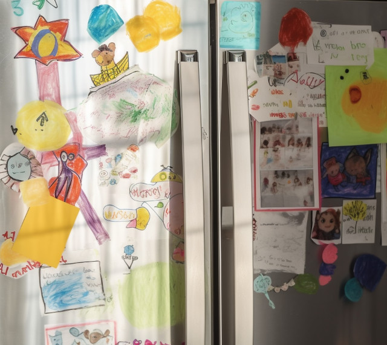

<figure><figcaption>Love the drawings on the fridge! Image credit: <a href="ai-art">AI+</a></figcaption></figure>

Crayoned sheaves adorn the fridge
in magnet-clipped bouquets&mdash;
stick-man family small to big,
gulls, sharp peaks, some yellow rays,
smoking chimney, circle trees,
tulips sprung from scribbled green...

An engineer, Dad tweaks the tilt,
saves straggling papers now and then.
Mom might shuffle tints to match
her curtains or her tablecloth&mdash;
but doesn’t. It’s heart, not art
that yields construction paper glory.

<figure><figcaption>A much fancier house sits just down the road from mine. It looks a bit like this... Image credit: <a href="ai-art">AI+</a></figcaption></figure>

A suitcased pilgrimmage away
another house of glory stands.
Family scenes dot its walls, too &mdash;
Shepherd, angels, holy lands,
fishers, lepers, pioneers &mdash;
sketched by children’s hands.

He might make the lines run truer.
She might make the colors glow &mdash;
but the harmony they’re after &mdash;
the perfect smiles and laughter &mdash;
is deeper than lines, whiter than hue
not about things, but who.

