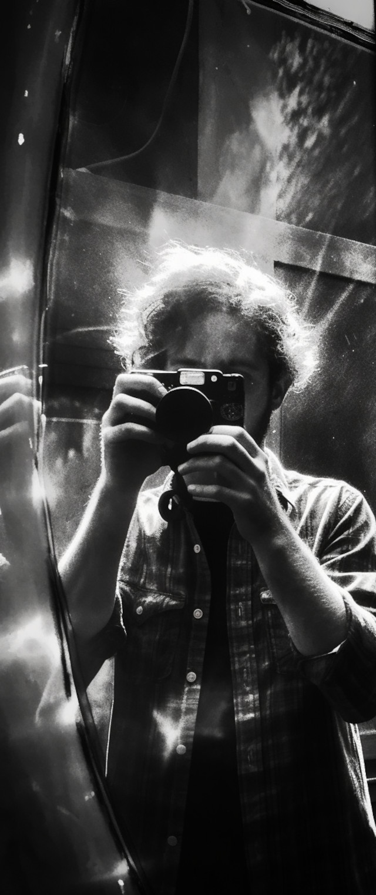

It's sad enough to shade your face
in rooms where women waltz their words,
dissecting Michaelangelo,
and smile, tree-hungry, weary of the art.
But when the partly-living go
I strain to sense your absence, now.
The last I knew you was the day
the dog barked out her ecstasy
and wagged to see me coming near
and jumped and whined and wouldn't sit,
deaf to all my peevish threat.
And in her honest artlessness,
she licked her way right through to you,
and you and she played peek-a-boo
while I observed with distant eyes,
half enthralled despite myself.
But I have lately lost you, friend,
from waltzing one too many times
to worn-out seem and reputation;
and yet, your memory bids me cry:
above the beat, shout me your name.
I know you have one, mirror man.

<figure><figcaption>Image credit: Midjourney</figcaption></figure>
