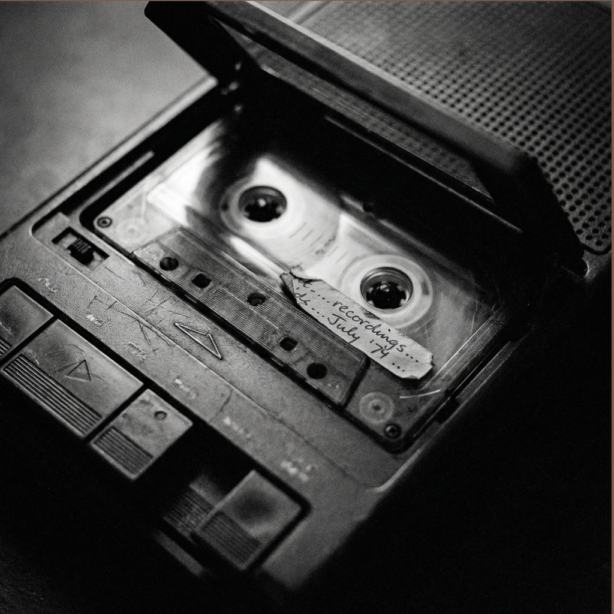

Lyrics are by [me collaborating with AI](ai-collab). Performance by [Harrow](harrow) on [suno](https://suno.com/song/7616f869-c30a-4515-a633-cae06d7ab42e). 

<figure>

<figcaption>Image credit: <a href="ai-art">AI+</a></figcaption>
</figure>

[Verse]
The house was cold for Mom and babe,
So she came too and set things right.
She swept the floor and fed the rest
So Mom could nurse and sleep at night.
She bought a heater, plugged it in,
And said to keep it working there.

[Chorus]
Left it humming through the night
Left the heater warm and low
Left a note as on she went
Left a note

[Verse]
She met men rescued from Bataan
With penicillin, gauze, IVs.
Held spoons to lips, learned names, and then
Gave fudge to soften homesick dreams.
Lived rough and cold, made foreign friends,
And kept the ward in working shape.

[Chorus]
Left it humming through the night
Left the hospital calm and low
Left a note as on she went
Left a note

[Verse]
At home she gave the piano place
And traced soprano, alto lines.
She showed the girls how parts entwine
So point and counter unify.
On Sundays in the choir she stood
And sang her line to lift the rest.

[Chorus]
Left it humming through the night
Left the singing sweet and low
Left a note as on she went
Left a note

[Verse]
Her toddler climbed with glass in hand
Then fell and cut soft face on shards.
She hugged the child and cleared the glass
And spoke so all the kids grew calm.
She sent next door to fetch a car
And bore the wounded child away.

[Chorus]
Left it humming through the night
Left the home front still and low
Left a note as on she went
Left a note

[Verse]
She mailed a tape so grandkids heard
Her nursery rhymes and poems at night.
They played it softly by their beds
Till breathing slowed and eyes grew closed.
Her gentle voice kept time with dreams
Till ribbon thinned and faded out.

[Chorus]
Left it humming through the night
Left recording soft and low
Left a note as on she went
Left a note

## Liner Notes
Ora Mae Hyatt (1922–2017) lived a life marked by an unusual combination of skill, warmth, and calm authority. She was trained as a nurse during World War II and served with the U.S. Army Nurse Corps in the Pacific, stationed in Okinawa near the end of the war and later in Tokyo immediately after the Japanese surrender. There she cared for soldiers returning from the Pacific theater—men suffering not only from physical wounds but from hunger, exhaustion, and psychological trauma, including survivors of the Bataan Death March. Her work was repetitive and unspectacular: tending bodies, restoring basic rhythms, helping people hold together long enough to go on.

During that period, she also made and distributed fudge to soldiers at Christmas—an ordinary, human gesture offered as something solid and familiar in a disordered moment. These wartime experiences shaped her calm, practical way of responding to crisis, a way of acting that would later appear just as clearly in family life.

Music was not an ornament in Ora Mae’s life; it was a practice. As a young woman she sang in a trio in high school, won a competition, and performed on the radio. Decades later, at her fiftieth high school reunion, the trio sang together again. She sang to her children—songs like “You Are My Sunshine,” “Clementine,” and “Red Wing”—and taught her daughters to sing harmony deliberately, using a church hymn as a primer. She longed to play the piano, bought one with U.S. savings bonds when her oldest daughter was young, and became her children’s first piano teacher. Though family responsibilities limited her own practice, she continued to value music deeply, returning to formal piano lessons later in life, even taking lessons again in her nineties.

Her calm competence showed itself vividly in ordinary emergencies. When one of her young daughters, Beverly, was badly injured by broken glass in a kitchen accident, Ora Mae responded quickly and without panic. She gave clear instructions, washed blood from her daughter’s eyes, and arranged immediate transport to the hospital, later making structural changes—such as acquiring a second car—so she could respond independently in future crises. Her children grew up assuming that this was how emergencies were handled: with clarity, speed, and steadiness.

Ora Mae’s life was also marked by an unusual ease across cultural divides. Despite her wartime service, she formed close friendships with Japanese people after the war, later with German friends in Milwaukee, and eventually with Filipina friends during her missionary service in the Philippines. Difference did not harden into resentment; it was met with attentiveness and respect.

As a grandmother living at a distance, she recorded cassette tapes of nursery rhymes, poems, and songs and mailed them to her grandchildren. These tapes were played repeatedly until they wore thin, her voice continuing to bring order and comfort even when she was not present.

*Left a Note* draws from these moments. It is not a summary of a life, but a portrait of a method: the practiced ability to bring disorder—musical, physical, emotional, or relational—back into workable harmony, and then to trust that harmony to hold as Ora Mae moved on to the next place where it was needed. 
