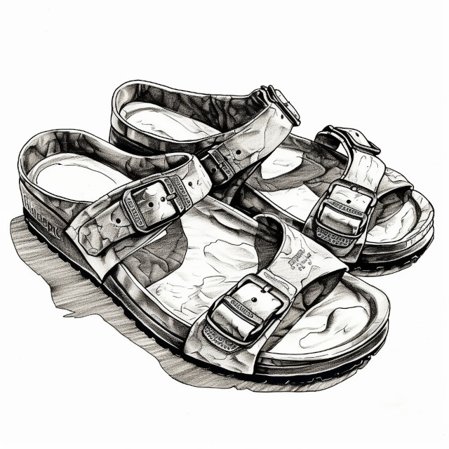

His name was Matt, but everyone called him Mahatma. Probably it was the sandals that did it. Or maybe the haircut.

<figure></a><figcaption>Image credit: Midjourney</figcaption></figure>

On his twenty-first birthday, Matt forever renounced his omnivorous prejudices. No more would he be party to the needless suffering and slaughter of animals. Matt found much peace of mind after that, until the day he realized The Great Truth: so long as he allowed others to eat as they chose, he consented to their barbarism.

The thought was too much. Tormented, Matt walked to the nearest supermarket and shot everyone at the meat counter.

*This story was written many years before we started hearing news stories about active shooters. I am now a bit concerned that it needs a trigger warning. I leave it here because it remains what it always was: a condemnation of hypocrisy in those who use violence to force people to be virtuous.*