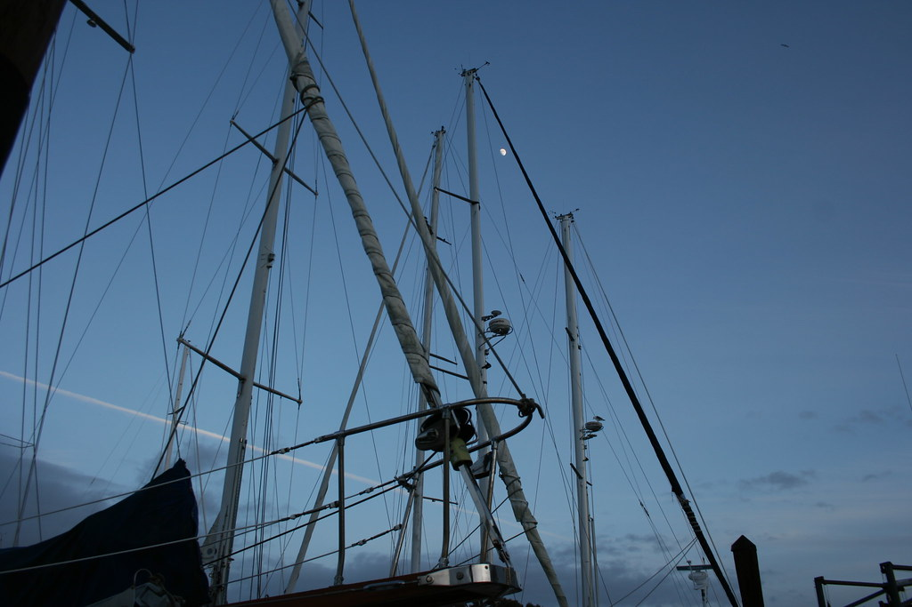

<figure>

<figcaption>Photographer: me</figcaption>
</figure>

human lines cut blue
framing waiting old man moon
who'll smile from the dark

Taken at Sausalito Marina, December 2012. The sun was down; dusk was fading.

Learning to sail is on my bucket list...

[<a href="https://www.flickr.com/photos/daniel_hardman/8331434557/sizes/l/">other photo sizes</a>]