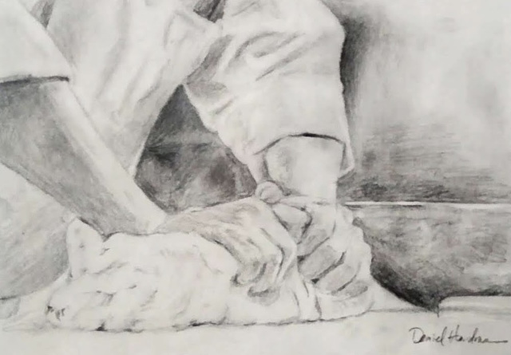

*for Mom*

What once were raw ingredients
have formed a sticky, tender dough--
inchoate bump of someday-bread, 
new ris'n, part-proved, and halfway grown.

To pull potential from its crib,
now practiced mother hands reach down
and stretch this unbaked project out
to knead and mold upon her slab.

A rain of flour dries what's wet--
a tale, a touch, a treat, an ear...
A push, a fold, a flip, a stretch--
a fast, a prayer, a task, a tear...

The patient hands coax out and in,
transforming batch with staff of life,
again, again, and yet again--
invoking, strengthening strands that bind.

It's humble, quiet, taxing toil,
this rhythm that rocks and shapes her loaves--
generous, intimate, personal.
It's faith in action, sweet hearth hope.

Perhaps that Man who loves to feed
with loaves and fishes, named Himself
the Bread of Life in part because
He'd loved the hands that kneaded Him--

loved mother's cheeks all streaked with flour,
loved hope baked fresh, served gold and soft.
Perhaps he helped her, too, some hours--
and prized her kneading, feeding love.

