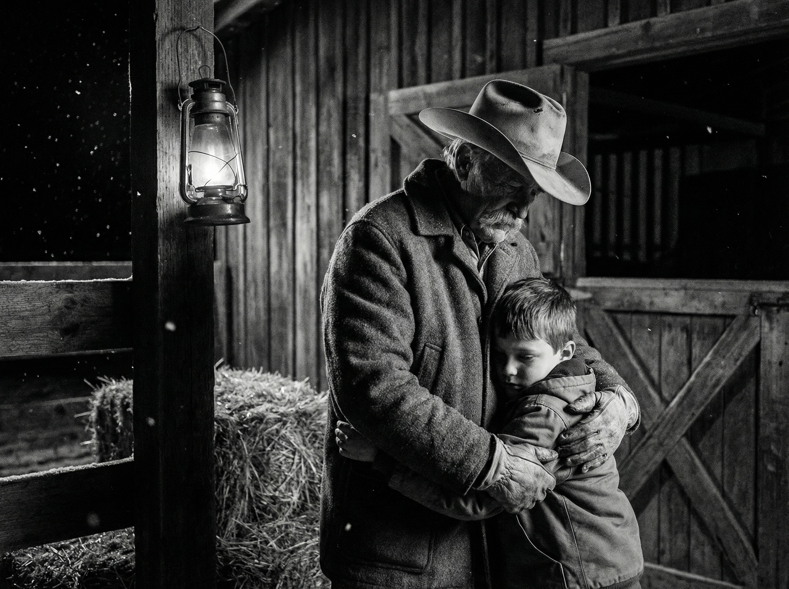

George Hardman was a cowboy who was born in Huntsville, Utah, in the 1870s and lived in Star Valley, Wyoming, Malad, Idaho, and other parts of the mountain west. All the stories in this song are from his autobiography and related sources. Lyrics are by [me collaborating with AI](ai-collab).

[listen to a performance of the song](https://suno.com/song/e537f3cc-04d0-4d75-b352-5981b79be6aa) 

<figure>

<figcaption>Image credit: <a href="ai-art">AI+</a></figcaption>
</figure>

[Verse 1]
Crouching low in autumn light,
George shot a deer. It ran from sight.
He chased till dark in jacket thin,
No gloves, wind whipped, snow driving in...
Relief came when he found a trail
Until he saw his own boot heel

[Refrain]
He did the next good thing,
Next good thing with what he had 
Ohhhh

[Verse 2]
Cold came brutal, froze to bone  
He passed out dim, woke spread in snow,
No sense of falling, he fought to stand,
Then wobbled on, then down again
He dropped what couldn't carry on
And stumbled on to keep his line

[Refrain]
He did the next good thing,
Next good thing with what he had 
Ohhhh

[Verse 3]
He piled needles, slept through storm,
Walked in the clear, then couldn't stand
So dropped to crawl on knees and hands
Through endless drifts till sight of home.
Fifty yards, then ten -- his hands
too numb, he hit the door with his head

[Refrain]
He did the next good thing,
Next good thing with what he had 
Ohhhh

[Bridge]
Warm air wrapped him  
Fire set
They hauled him in
And laid him flat
Ohhhh

[Verse 4]
Years on, he sent his boy to find
a stray horse, bridle in his hand.
Darkness fell, coyotes yipped,
the boy pushed on, alone
George sent men when his boy stayed gone,
pulled him close when they brought him home

[Refrain]
He did the next good thing,
Next good thing with what he had 
Ohhhh

[Verse 5]
Years brought pain and slowed his legs
The jobs ran thin but hands stayed game--
Leather work filled up his days.
Braiding stopped when his heart gave way 
He brought it as they bore him out
For a day that never came

[Refrain]
He did the next good thing,
Next good thing with what he had 
Ohhhh

[Outro]
George rests quiet
The belt hangs still
Ohhhh
He did the next good thing,
Next good thing with what he had  
Ohhhh
Ohhhh

