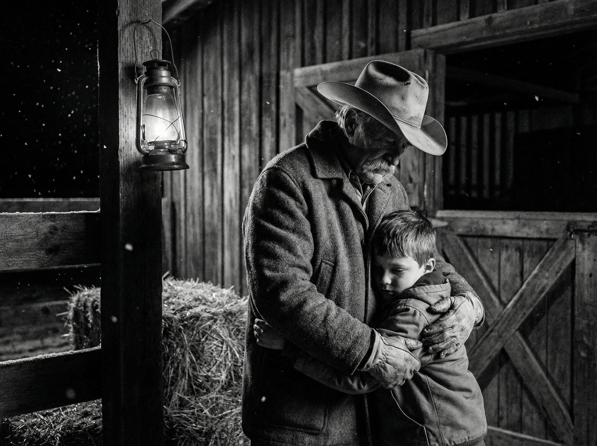

Lyrics are by [me collaborating with AI](ai-collab). Performance by [Harrow](harrow) on [suno](https://suno.com/song/e537f3cc-04d0-4d75-b352-5981b79be6aa). 

<figure>

<figcaption>Image credit: <a href="ai-art">AI+</a></figcaption>
</figure>

[Verse 1]
Crouching low in autumn light,
George shot a deer. It ran from sight.
He chased till dark in jacket thin,
No gloves, wind whipped, snow driving in...
Relief came when he found a trail
Until he saw his own boot heel

[Refrain]
He did the next good thing,
Next good thing with what he had 
Ohhhh

[Verse 2]
Cold came brutal, froze to bone  
He passed out dim, woke spread in snow,
No sense of falling, he fought to stand,
Then wobbled on, then down again
He dropped what couldn't carry on
And stumbled on to keep his line

[Refrain]
He did the next good thing,
Next good thing with what he had 
Ohhhh

[Verse 3]
He piled needles, slept through storm,
Walked in the clear, then couldn't stand
So dropped to crawl on knees and hands
Through endless drifts till sight of home.
Fifty yards, then ten -- his hands
too numb, he hit the door with his head

[Refrain]
He did the next good thing,
Next good thing with what he had 
Ohhhh

[Bridge]
Warm air wrapped him  
Fire set
They hauled him in
And laid him flat
Ohhhh

[Verse 4]
Years on, he sent his boy to find
a stray horse, bridle in his hand.
Darkness fell, coyotes yipped,
the boy pushed on, alone
George sent men when his boy stayed gone,
pulled him close when they brought him home

[Refrain]
He did the next good thing,
Next good thing with what he had 
Ohhhh

[Verse 5]
Years brought pain and slowed his legs
The jobs ran thin but hands stayed game--
Leather work filled up his days.
Braiding stopped when his heart gave way 
He brought it as they bore him out
For a day that never came

[Refrain]
He did the next good thing,
Next good thing with what he had 
Ohhhh

[Outro]
George rests quiet
The belt hangs still
Ohhhh
He did the next good thing,
Next good thing with what he had  
Ohhhh
Ohhhh

## Liner Notes

George Hardman was a true cowboy. He grew up and lived much of his life in the high country of Utah and Wyoming in the late 1800s, shaped early by loss, work, and responsibility. His mother died when he was a boy, leaving a household that learned quickly how to get by without much margin. From adolescence on, George worked—hauling, hunting, cutting timber, tending stock—often alone, often far from help, in weather that did not care whether a man was ready for it.

One winter hunting trip nearly ended his life. Separated from companions, underdressed and without food or matches, he followed a trail too long and too far. As night fell, exhaustion set in. He began to stumble, then fall, then collapse outright in the snow, over and over. Eventually he dropped what he was carrying, crawled when he could no longer trust his legs, and reached shelter sometime after midnight. The song’s images of falling, crawling, and letting go point to that night—but they also point beyond it.

This was not an isolated ordeal. George survived other moments the same way: pinned under a heavy log with no one coming, lost in storms, worn down by illness later in life. What carried him through was not bravado or recklessness, but thinking of those who depended on him, doing the next necessary thing, and refusing to quit even when quitting would have been understandable.

That is why his story belongs here. George Hardman was strong, but never loud about it. His iron was tender: shaped by ordinary labor, quiet faith, and the long practice of showing up again the next day.