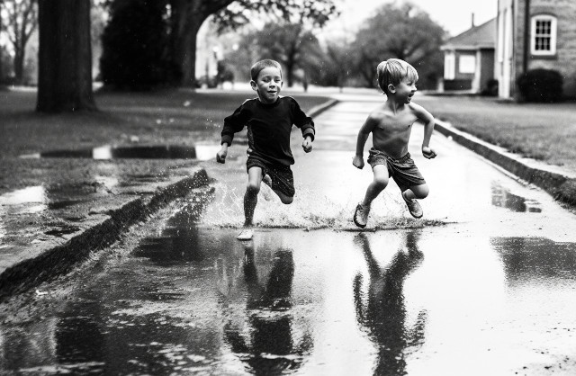

<figure>
<figcaption>Image credit: <a href="ai-art">AI+</a></figcaption></figure>

My friend, does rain still set you thinking
About our day of perfect puddle splendor?
We shook our plastered hair, and blinking,
Rubbed our chins to catch the water under.
And while I squinted in the luscious wet
You stomped me, squealing with delight;
I followed wild where your dodging led,
Splashing, sloshing madly left and right
Until we stopped our silly, breathless races
And shiver-giggled, dripping, shiny-eyed
And wiped the mud spots from our freckled faces
And grinned in eager rapture side to side.
Our wet palms met to end the playful strife,
And we were water brothers then for life.

