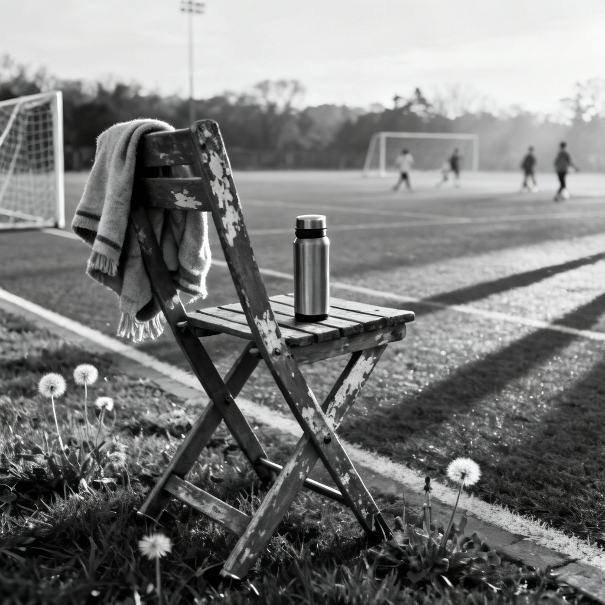

by: [me collaborating with AI](ai-collab)

[listen to a performance of the song](https://suno.com/s/KitpFT7KNRjFqcwR) 

<figure>

<figcaption>Image credit: <a href="ai-art">AI+</a></figcaption>
</figure>

[Verse 1]

White lines frame grass and dandelions.
Kids sprint breathless in the morning shine.
  hmm, yeah
She shoulders a blanket, tugs hat low,
Shakes a chair, ignores the score.
Her girl blocks a shot, sees Mama there --
Sometimes that’s enough to show you care.

hmmmm
hmmm
hmm, yeah

[Verse 2]

He planned to cruise life Cadillac-style.
But dreams got cashed when the rent came due.
  hmm, yeah
Now he drives to a place where boxes pile,
Punches numbers like he’s s’posed to do.
Not the life he pictured when he was young —
But it buys shoes, wagons, and meals at home.

[Chorus]

Showin’ up when you lack answers.
Showin’ up when your hands just shake.
All you can give is the time it takes.
  hmm, yeah
Faith ain’t loud, it’s quiet, and tough —
The hardest, truest work of love
Is simply showin’ up.
  hmm, yeah

(brief guitar flourish)

[Verse 3]

The staff scans his keys, clangs open the gate.
Flips through his Bible, returns to a seat.
He enters and smiles, then waves to invite
And surveys the circle for sheep gone today.
  hmm, yeah
Then listens, questions, tells a joke, speaks a name.
They may lose his words, but they keep that he came.

hmmmm
hmmm
hmm, yeah

[Verse 4]

Thin as a whisper, hurting and light,
Machines toll time where words can’t reach.
She reads him notes on cards, device,
Stories, memories, questions, a crayoned scene.
  hmm, yeah
Grace ain’t in money, miles, or fuss —
It’s hearts being present: “We’re still with you -- that’s us.”
  hmm, yeah

[Bridge]

A thousand ways to say you care,
Most fade fast in rush and talk...
Sometimes love shows best just...
  standing there --
Being present’s how you walk the walk.

[Chorus]

Showin’ up when you ain’t got answers.
Showin’ up when the road gets rough.
Lovin’ by...
  just being there enough.
  hmm, yeah
Love don’t need polish, proof, or stuff --
The bravest, holiest thing we do
Is simply...
  showin’ up.

hmmmm
hmmmm
hmmm
hmm, yeah
(Soft guitar fade, one last suspended chord left hanging.)

