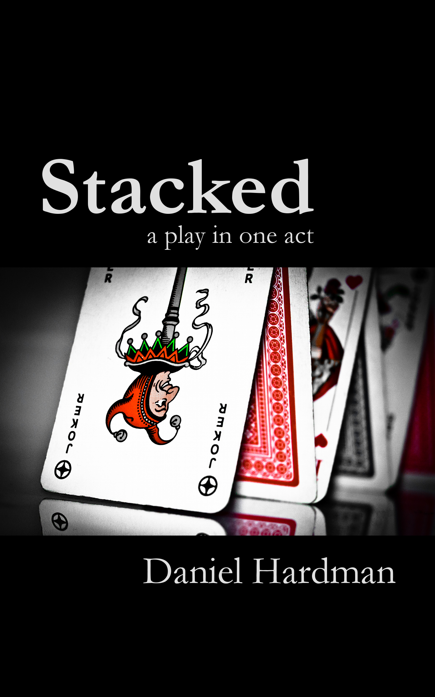

I took the one-act play that I wrote a while ago, and published it <a href="https://www.amazon.com/Stacked-play-one-Daniel-Hardman/dp/1481282948" target="_blank">in book form</a> and on <a href="https://www.amazon.com/Stacked-play-one-act-ebook/dp/B00APMOGMG" target="_blank">Kindle</a>. Fun project.

Here's the description from the book's back cover:

>Are human beings doomed to muddle through a dreary existence, bereft of hope? Can we do better than put a brave face on it, as <a title="Albert Camus" href="https://en.wikipedia.org/wiki/Albert_Camus" target="_blank">Camus</a> recommended in "The Myth of Sysiphus"?

>In this classic response to existential favorites such as "<a title="Waiting for Godot" href="https://en.wikipedia.org/wiki/Waiting_for_Godot" target="_blank">Waiting for Godot</a>" and "<a title="Rosencrantz and Guildenstern Are Dead" href="https://en.wikipedia.org/wiki/Rosencrantz_and_Guildenstern_Are_Dead" target="_blank">Rosencrantz and Guildenstern Are Dead</a>", two actors wrestle with science, religion, an unseen director, and their own choices about how they'll interpret the script they've been given.

>Eminently readable and easy to stage, this edition of the play now includes discussion questions for classroom learning and book groups.