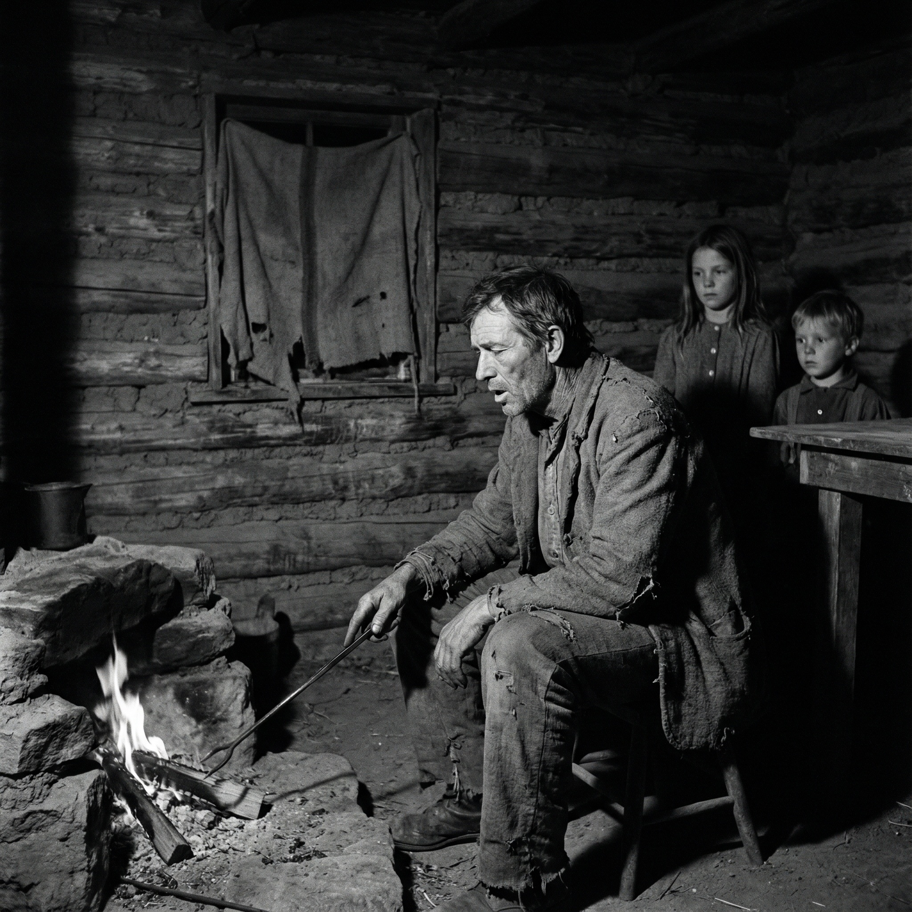

Abraham Stephens was a Mormon pioneer who lived in Panguitch, Henrieville, and other parts of southern Utah in the late 1800s. His wife was lost to mental illness, leaving him with young children to raise alone. He died suddenly, in the middle of the night, in his 40s. His daughter remembers him singing "Foggy, Foggy Dew" and other songs by firelight in their rough cabin after her Mother was gone. Lyrics are by [me collaborating with AI](ai-collab).

[listen to a performance of the song](https://suno.com/playlist/43b124b5-8297-4204-832b-206e7cf23e7d) 

<figure>

<figcaption>Image credit: <a href="ai-art">AI+</a></figcaption>
</figure>

[Verse 1]
With Mother gone the dark hurt more
In empty red-rock land
We split green pine and hauled tin pails
Till every lip was cracked

[Refrain]
He kept his tears held back

[Verse 2]
When beans and ash-cakes both were gone
He sang so soft and low
The words clung quiet in his throat
We barely heard them go

[Refrain]
He kept his tears held back

[Verse 3]
We learned to read the way he moved
And what he would not say
He held his sorrow back from us
So sleep could find its way

[Refrain]
He kept his tears held back

[Coda]
By dawn the fire was ashy black
The work once more begun

[Refrain]
He kept his tears held back

