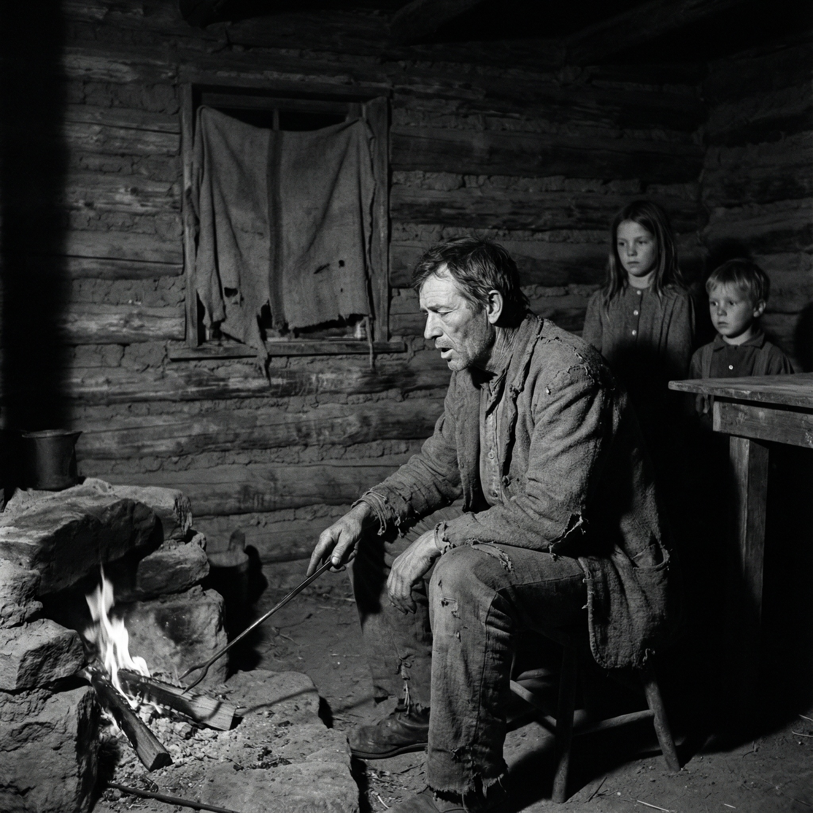

Lyrics are by [me collaborating with AI](ai-collab). Performance by [Harrow](harrow) on [suno](https://suno.com/playlist/43b124b5-8297-4204-832b-206e7cf23e7d). 

<figure>

<figcaption>Image credit: <a href="ai-art">AI+</a></figcaption>
</figure>

[Verse 1]
With Mother gone the dark hurt more
In empty red-rock land
We split green pine and hauled tin pails
Till every lip was cracked

[Refrain]
He kept his tears held back

[Verse 2]
When beans and ash-cakes both were gone
He sang so soft and low
The words clung quiet in his throat
We barely heard them go

[Refrain]
He kept his tears held back

[Verse 3]
We learned to read the way he moved
And what he would not say
He held his sorrow back from us
So sleep could find its way

[Refrain]
He kept his tears held back

[Coda]
By dawn the fire was ashy black
The work once more begun

[Refrain]
He kept his tears held back

## Liner Notes

This song, sung from the perspective of his daughter Annie, remembers **Abraham Stephens** as a man who stayed. He was a Mormon pioneer and laborer in small southern Utah settlements, doing hired work where he could, living close to the edge of subsistence. His life narrowed suddenly when his wife, Leah Jane, broke under illness and exhaustion and was taken away. What followed was not tidy resolution, but responsibility.

Left with young children and no clear path forward, Abe did what many men fail to do: he stayed. He cooked. He worked. He kept the children fed and near him. He moved when he had to, started over when starting over was the only option, and carried grief without ceremony. There are no records of speeches or declarations, only the testimony of a child who remembered evenings after work was done, when the house was quiet and her father would sing softly to himself. One of those songs, "Foggy Foggy Dew", is particularly tender and embodies what Abe must have thought about.

Abe's song gestures toward those moments: a fire burning low, children holding still, a tune whose meaning was never explained. The singing was not performance or comfort so much as containment—a way of holding sorrow without letting it spill onto those who depended on him. By morning, the work resumed.
