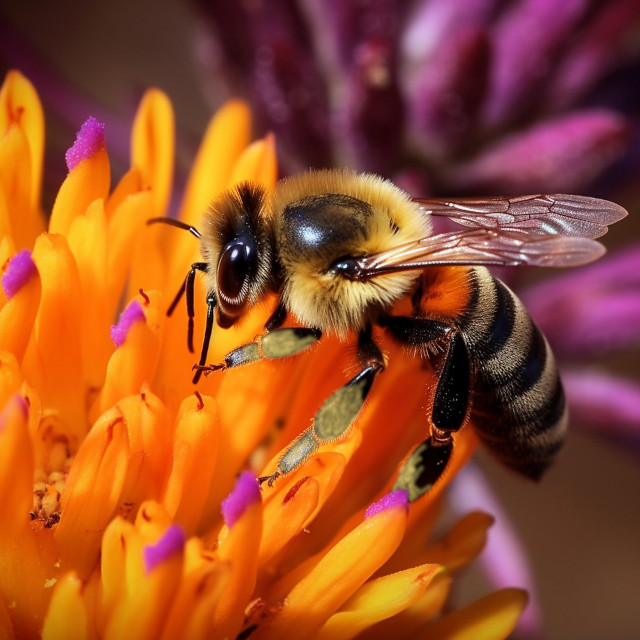
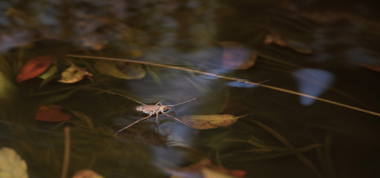
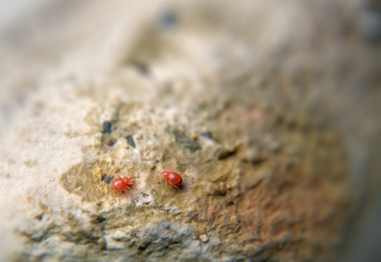

As a child I loved to look at Richard Scarry books. Though the words were sparse, they were full of huge, full-color, meticulously detailed illustrations. I can remember staring at one particular scene for perhaps an hour, trying to absorb all the creatures, colors, shadows, and other minutiae of the drawing. In the end I concluded that such an aim was nearly hopeless: no matter how long or carefully I looked I could still look longer, and perhaps find something new.

When I was a freshman in college I was assigned to observe nature and then write a paper detailing what I learned. As I did my nature study, my experience with books as a child came to mind. I realized that nature, like Richard Scarry's pictures, is only more wonderful and complex as it is examined closely, and that its secrets are inexhaustible.

Such a conclusion was not always evident, though. I began observing nature by watching bees, and at first that's about all I saw. Bees flying from flower to flower. Ho hum... But when I really began observing, I saw a lot more. For one thing, I had never seen such hard work and devotion to a single purpose. They landed on the flowers and without a moment to rest began gleaning the nectar. The bees were so busy that even before finishing one flower, they would start to walk toward another, tilting and rolling their heads to continue sucking as they walked. After a few flowers, the bees would take to the air and randomly select a new patch.

<figure></figure>

As my attention to detail grew, I noticed that even as the bees flew they had their proboscises extended &mdash; they began sucking nectar before their feet touched the flowers. Soon I discovered individual variations in the bees, such as the amount of pollen on their legs. I also found that the bees actually had some direct effect on their environment; the tiny flower petals bent with the weight of the insects, and once some dust and debris on the ground was blown away by the downwash from a bee's wings. I was completely captivated when my observation time ended. As I walked away from the flower bed I wondered what sights I was leaving behind.

Two days later I went out to observe again. As I walked along, a small stream caught my eye, and I paused to examine it more closely. At first I saw only one thing &mdash; black water. As I focused my attention, however, a mini-world appeared. The water was dark, and obscured the bottom of the ditch almost fully, but it was clear, not murky. The current was fairly slow, but strong. As I sat I saw leaves in the water, carried along and tumbled, alternatingly rising and sinking with the push of the flow. They were many-colored &mdash; yellow, rust, cream, brown, orange, even faintly lavender. The current also carried assorted blades and clumps of grass and water plants along. Some water bugs with long front legs which they used like oars skated across the surface. I could see the dimples which their feet made in the surface; each time the bugs swept their front legs back to move, they created tiny concentric ripples which crossed with those of the other bugs to form a wavy checkerboard of water wrinkles.

<figure></figure>

Generally the creatures stayed to the side, where the current curled back on itself. Periodically they would drift into the central current, though, and then they had to work hard to return to their little corner. Where the surface changed from shadow to sun I spotted a sparse group of whitish, gnat-like insects. They flew a few inches above the surface, circling and swerving lazily. I was about to dismiss them from my attention when I noticed something very strange &mdash; they seemed to be flying against an air current just like that of the stream. Although they constantly flew toward the shade, they never seemed to get there, but stayed just barely in the sunlight.

Eventually I left the stream and headed for the flower bed. I had to cross a parking lot on the way, and as I did I decided to see if there was any life on the faded asphalt. I squatted down and examined the dirty, worn pebbles for any signs of life. At first my search was entirely fruitless, but on the curb at the side of the lot I discovered all sorts of miniature arthropods. A few were nearly half as big as the head of a pin; the rest were smaller. One kind that was fairly prolific was a tiny red mite. Dozens of them were walking with nearly imperceptible legs on the hard cement. I was in a hurry, so I left, but as I did I found myself feeling much the same as I had when leaving the bees behind. My curiosity was piqued: what would I not get to see?

<figure></figure>

I was almost to the flowers when I walked past a small tree and noticed a faint glint on a leaf. The late afternoon sun was low enough to just tickle a few strands of spider web. There were four of them stretched from one end of a leaf to the other, like the strings on a primitive lyre. I could not see the spider, and wondered if perhaps it was dead, having starved after making such a tiny web in such an impractical (or at least unusual) form. As I turned to go I spied a much larger strand of spider web, floating free in the air. By moving my head slightly, I was able to move the sunlight along several feet of it. And then a breeze touche it lightly, and though I knew it was still there, I couldn't see it at all.

I walked the rest of the way to the flower bed and looked around. The flowers were shaded, the bees gone. I was disappointed. I sat on a bench and began to take notes on the flowers anyway: "Around the outside edge are some lovely pink flowers about two feet high. They have five teardrop-shaped petals which whiten near the center..." I continued for five to ten minutes on the pink flowers before it occurred to me that my task was really quite difficult. Depending on how much detail I wanted to use, I could describe the pink flowers for ages. I waded my way through the description of the leaves of the pink flowers, but eventually I gave up. There was just too much to describe.

After I returned from my observation, I thought about what I had seen. What could I conclude? The best answer that I found was another question: What didn't I see? From my experience, I was sure that I had missed the great majority of what was right before my eyes. Nature, I mused, is much like those marvelous Richard Scarry pictures. I can look and look and look, and as long as I look there will always be more to see.

Some think that ultimately mankind will know everything, if science is allowed to progress enough. My observations of nature, though, are a lesson in humility. They lead me to believe that such an idea is arrogant or at least unrealistic. I though I knew that bees were busy, but I had no idea that they were busy enough to extend proboscises while still in flight until I saw it; I still cannot comprehend the frenzy it must take to make their wings beat a thousand times per minute. I saw some red mites on the blacktop surface of a parking lot, but not the worms a foot beneath them. I saw flowers, but what I saw was actually only half of the plant. The roots remain hidden.

Each time I changed the scale of my observation, or altered my perspective or looked harder, I saw a previously unnoticed aspect of nature.

I underestimate the world.

The stream is more than water: it is cold black liquid, spotted with shade, pushing leaves, supporting water bugs, swaying seaweed, leaking into the ground and watering the world around it. Like flowers or the stream, the world also is more than meets the eye.

Though I can discover much more of the world than I thought possible, my vision (and perception in general) is limited. I can't see the protozoa in a stream or the individual grains of pollen in a flower. It goes beyond that, though. I can't see the roots of grass, the inside of a bee, or what is in the back of my head. And seeing is certainly not my only limited sense. The footsteps of a the red mites probably made a distinct pitter-patter; yet I didn't hear it. I don't know what air tastes like, or how nectar smells.

In a very real way, then, I get a simplified picture. Even in the best circumstances, some things &mdash; the overwhelming majority of things &mdash; go unnoticed. I need to remember some of my inadequacy and ignorance. As I learn to truly perceive, I will probably continue to find that the world is like a Richard Scarry picture &mdash; there is always something else to discover; always more, not less to learn.

Images credit: [AI+](ai-art)