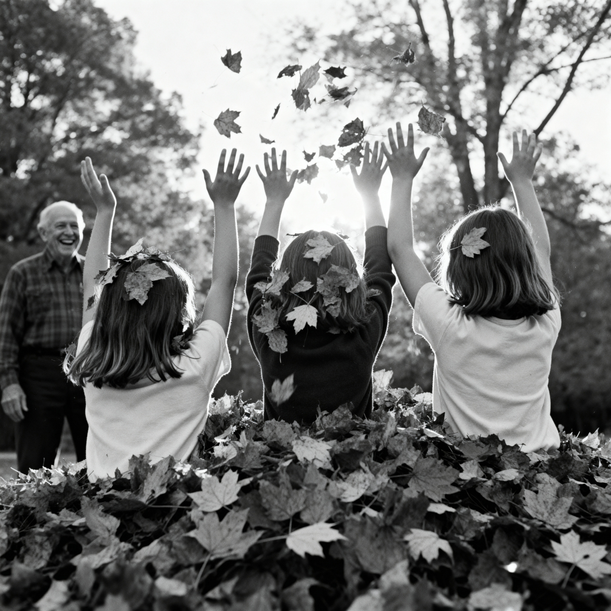

Lyrics are by [me collaborating with AI](ai-collab).

[listen to a performance of the song](https://suno.com/s/u9IKxbC693OmDFsw) 

<figure>

<figcaption>Image credit: <a href="ai-art">AI+</a></figcaption>
</figure>

[Verse 1]
November gives one golden day,
To girls who've never seen leaves play.
Three stand and stare at amber piles,
Then dive in headlong, wild-eyed smiles.
Rust and cream go flying high,
Squeals of joy beneath blue sky.

[Chorus]
Building more than castles here,
Catching more than children dear.
Gold won't last beyond the freeze,
But something's planted deep in these—
Love that fills the empty spaces,
Joy that lights their upturned faces.

[Verse 2]
Grandpa wades in, throws them high,
Three small bodies toward the sky.
Grandma tosses armfuls too,
Leaves rain down, confetti storm.
Giggling, gasping, begging "More!"
Joy they've never felt before.

[Chorus]
Building more than castles here,
Catching more than children dear.
Gold won't last beyond the freeze,
But something's planted deep in these—
Love that fills the empty spaces,
Joy that lights their upturned faces.

[Bridge]
One can't remember, two see less,
The men who could be here to catch.
Missing pieces, missing hands,
But today fills with their laughs.
When others can't be lifting high,
Love finds other hands nearby.

[Verse 3]
Shadows lengthen, they're not done,
One more toss before day's gone.
Girls don't know what November means—
How gold fades into winter's scenes.
Gray hairs know—that's why they stay,
Making sacred children's play.

[Final Chorus]
Building more than castles here,
Giving more than one bright year.
Gold will fade, and so will we—
What remains is memory:
Memory of warmth and light,
One autumn afternoon so bright.

[Outro]
Three pairs of boots in gold,
A layer of loving laughs they'll hold.
Leaves will scatter, light will fade,
But this moment — this they made.

