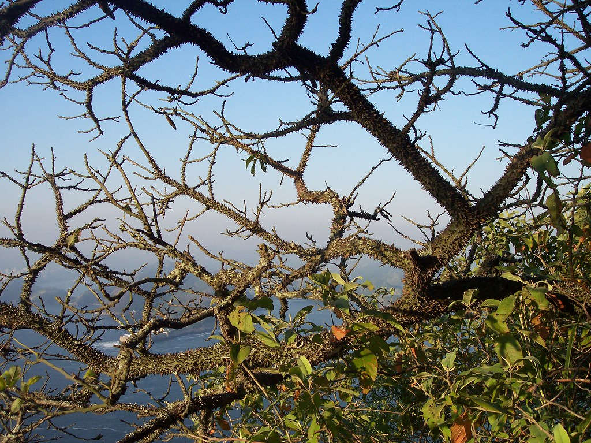

<figure>

<figcaption>Photographer: me</figcaption>
</figure>

spikes bristle, covering
every growing inch in thorn &mdash; 
green treasure hides? where?

I find it ironic that this particular tree is known as a "<a href="https://en.wikipedia.org/wiki/Floss_silk_tree" target="_blank">floss silk</a>." It is entirely covered in sharp thorns &mdash; not exactly smooth on the skin! However, it <em>is</em> beautiful.

Took this from <a href="https://en.wikipedia.org/wiki/Sugarloaf_Mountain_(Brazil)" target="_blank">Sugarloaf</a> (Pão de Açúcar), looking down into the harbor in Rio de Janeiro, Brazil.

[<a href="https://www.flickr.com/photos/daniel_hardman/1414044050/sizes/l" target="_blank">other photo sizes</a>]