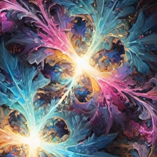

Tolemis is a persona that I created to capture my instrumental [AI collaborations](ai-collab) that have a New Age/Synthwave/Soundtrack vibe. Tolemis is inspired by my lifelong appreciation for Vangelis, and I use this persona to create soundtracks for my novels, among other things.

## Albums
* [Cordimancy (novel soundtrack)](https://distrokid.com/hyperfollow/tolemis/cordimancy-novel-soundtrack) (2026)
* [Pianissimo](https://distrokid.com/hyperfollow/tolemis/pianissimo) (2026)
* [Cyberiad Dreams](https://distrokid.com/hyperfollow/tolemis/cyberiad-dreams) (2026)
* [Circumsolar](https://distrokid.com/hyperfollow/tolemis/circumsolar) (2025)
* [Animalia](https://suno.com/playlist/a7d18804-df7e-4a6c-adbb-9d4840b708eb) (2025)
* [Viking (novel soundtrack)](https://suno.com/playlist/1d0360cb-941b-4e13-b802-f2cbac07dea8) (2025)
* [Iscah (novel soundtrack)](https://suno.com/playlist/8c345c43-59cd-4b45-861a-96fc0e97202d) (2025)
